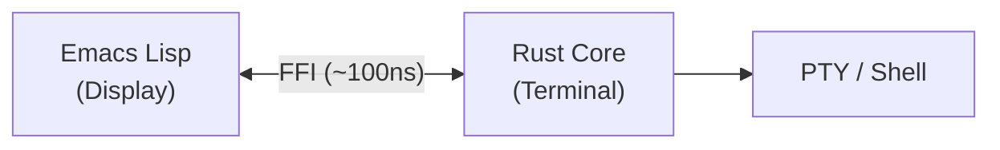

# Kuro - Modern Terminal Emulator for Emacs


A high-performance terminal emulator for Emacs, powered by a Rust dynamic module with an Emacs Lisp display layer.

## Features

- **High Performance**: >100MB/s VT parse rate, <1us FFI call overhead, <16ms/frame rendering
- **VTE Compliance**: VT100/VT220 compatible with cursor movement, erase, scroll regions, insert/delete, tab stops
- **SGR Attributes**: Bold, italic, underline, blink, reverse, strikethrough, conceal, dim; 256-color and TrueColor
- **Kitty Protocols**: Kitty Graphics Protocol (APC), Kitty Keyboard Protocol
- **OSC Support**: OSC 7 (CWD), OSC 8 (hyperlinks), OSC 52 (clipboard), OSC 133 (shell integration)
- **Sixel Graphics**: Inline image display via Sixel protocol
- **Unicode**: Full CJK support, grapheme clusters, emoji (unicode-width)
- **Multi-session**: Multiple terminal sessions with independent state, auto-reaping of dead sessions
- **Scrollback**: Configurable scrollback buffer with efficient memory usage
- **Emacs Integration**: Native theme support, face-based rendering, prompt navigation (OSC 133)

## Installation

### Requirements

- Emacs 29.1 or later
- Rust 1.84.0 or later (MSRV)
- Linux, macOS, or Windows (WSL2)

### From Source

```bash
git clone https://github.com/takeokunn/kuro.git
cd kuro
make build
make install
```

The `make install` target copies the compiled dynamic module to `~/.local/share/kuro/`.

### With Nix

```bash
nix develop  # Enter development shell with all dependencies
make build
make install
```

### MELPA

MELPA packaging is prepared (recipe, `.elpaignore`, package-lint CI). Submission pending.

```elisp
;; Once published:
M-x package-install RET kuro RET
```

## Quick Start

```elisp
(require 'kuro)
(kuro-create "bash")
```

### Key Bindings

| Key | Action |
|-----|--------|
| `C-c C-c` | Send interrupt (SIGINT) |
| `C-c C-z` | Send SIGSTOP |
| `C-c C-\` | Send SIGQUIT |
| `C-c C-p` | Previous prompt (OSC 133) |
| `C-c C-n` | Next prompt (OSC 133) |
| `C-c C-t` | Toggle copy mode |

## Status

Kuro is feature-complete at v1.0.0. The Rust core passes 993 tests (938 unit + 55 integration) and the Emacs Lisp layer passes 943 ERT tests (701 unit + 148 integration + 94 e2e). Clippy runs in pedantic + nursery mode with 0 warnings. CI covers Linux, macOS, and WSL2 across Emacs 29.1/29.4/30.1 with Rust stable. The project includes 4 fuzz targets and 4 criterion benchmark suites.

## Architecture

Kuro uses the **Remote Display Model** -- all terminal state lives in Rust, Emacs is purely the display layer.



### Rust Core (`rust-core/src/`)

| Module | Responsibility |
|--------|---------------|
| `parser/` | VT100/CSI/OSC/DCS/Sixel/Kitty protocol parsing |
| `grid/` | Terminal grid, cell storage, scrollback buffer |
| `pty/` | POSIX PTY spawning and I/O |
| `types/` | Domain types (Color, SgrAttributes, OscData) |
| `ffi/` | Emacs module FFI bridge and session management |

### Emacs Lisp (`emacs-lisp/`)

23 modules including: `kuro-module` (FFI bridge), `kuro-config`, `kuro-faces`, `kuro-renderer`, `kuro-input`, `kuro-stream`, `kuro-lifecycle`, `kuro-navigation` (OSC 133 prompt navigation).

## Development

### Build

```bash
make build       # Release build
make dev         # Debug build
```

### Test

```bash
make test        # Rust unit + integration tests (debug & release)
make test-elisp  # ERT tests
make test-e2e    # End-to-end shell tests (requires tmux)
make test-all    # Full suite: Rust + ERT + e2e
```

### Quality

```bash
make lint        # Clippy (pedantic, -D warnings)
make check       # Format check (cargo fmt --check)
make check-all   # fmt + lint + test
make bench       # Criterion benchmarks (requires nightly)
```

### Nix Development

The project includes a `flake.nix` for reproducible development:

```bash
nix develop      # Shell with Rust toolchain, Emacs, and all dependencies
```

## Contributing

Contributions welcome! See [CONTRIBUTING.md](CONTRIBUTING.md).

## License

MIT OR Apache-2.0 -- see [LICENSE](LICENSE).

## Acknowledgments

- Inspired by [emacs-libvterm](https://github.com/akermu/emacs-libvterm)
- Uses [vte](https://github.com/alacritty/vte) for VT parsing
- Uses [emacs-module-rs](https://github.com/ubolonton/emacs-module-rs) for FFI
