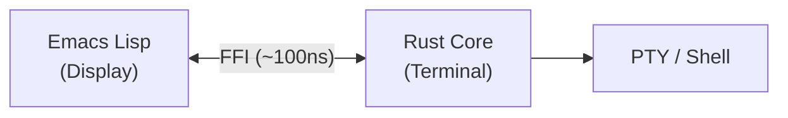

# Kuro - Modern Terminal Emulator for Emacs


A high-performance terminal emulator for Emacs, powered by a Rust dynamic module with an Emacs Lisp display layer.

## Features

- **High Performance**: >100MB/s VT parse rate, <1us FFI call overhead, <16ms/frame rendering
- **VTE Compliance**: VT100/VT220 compatible with cursor movement, erase, scroll regions, insert/delete, tab stops
- **SGR Attributes**: Bold, italic, underline, blink, reverse, strikethrough, conceal, dim; 256-color and TrueColor
- **Kitty Protocols**: Kitty Graphics Protocol (APC), Kitty Keyboard Protocol
- **OSC Support**: OSC 7 (CWD), OSC 8 (hyperlinks), OSC 52 (clipboard), OSC 133 shell integration with FinalTerm/Ghostty extras (`aid=`, `duration=`, `err=`, exit code on D-mark), with extras (aid, duration, err) rendered as left-margin status indicators and end-of-line annotations
- **Device Attributes**: DA1, DA2, DA3 (`CSI = c` → `DCS ! | 00000000 ST`)
- **Color Scheme Notifications**: DEC private mode 2031 + DSR 996 (Contour/Ghostty extension), automatically synchronized to Emacs's current theme via `enable-theme-functions`
- **Sixel Graphics**: Inline image display via Sixel protocol
- **Unicode**: Full CJK support, grapheme clusters, emoji (unicode-width)
- **Multi-session**: Multiple terminal sessions with independent state, auto-reaping of dead sessions
- **Scrollback**: Configurable scrollback buffer with efficient memory usage
- **Emacs Integration**: Native theme support, face-based rendering, prompt navigation (OSC 133)

## Installation

### Requirements

- Emacs 29.4 or later
- Rust 1.84.0 or later (MSRV)
- Linux or macOS
- [Nix](https://nixos.org/download) (recommended — provides all other dependencies)

### With Nix (recommended)

```bash
git clone https://github.com/takeokunn/kuro.git
cd kuro
nix run .#install   # build release + copy to ~/.local/share/kuro
```

Optionally add the `takeokunn-kuro` Cachix binary cache to avoid recompiling:

```bash
cachix use takeokunn-kuro
```

### From Source (without Nix)

Build the Rust dynamic module with cargo and place it where Emacs can load it:

```bash
git clone https://github.com/takeokunn/kuro.git
cd kuro
cargo build --release --manifest-path rust-core/Cargo.toml
mkdir -p ~/.local/share/kuro

# Linux:
cp rust-core/target/release/libkuro_core.so ~/.local/share/kuro/

# macOS:
cp rust-core/target/release/libkuro_core.dylib ~/.local/share/kuro/
```

After installing the Emacs package via `package.el` (see MELPA section below), you can also run `M-x kuro-module-build` to compile the native module from source via cargo, or `M-x kuro-module-download` to fetch a prebuilt binary.

### MELPA

MELPA packaging is prepared (recipe, `.elpaignore`, package-lint CI). Submission is pending the rollout of the GitHub Releases prebuilt-binary infrastructure, which ships native modules for the four supported platforms:

- `linux-x86_64`
- `linux-aarch64`
- `darwin-x86_64`
- `darwin-aarch64`

```elisp
;; Once published:
M-x package-install RET kuro RET

;; Then fetch the prebuilt native module for your platform:
M-x kuro-module-download

;; Or compile from source via cargo (requires a Rust toolchain):
M-x kuro-module-build
```

## Quick Start

```elisp
(require 'kuro)
(kuro-create "bash")
```

### Key Bindings

| Key | Action |
|-----|--------|
| `C-c C-c` | Send interrupt (SIGINT) |
| `C-c C-z` | Send SIGSTOP |
| `C-c C-\` | Send SIGQUIT |
| `C-c C-p` | Previous prompt (OSC 133) |
| `C-c C-n` | Next prompt (OSC 133) |
| `C-c C-t` | Toggle copy mode |
| `C-c C-SPC` | Toggle copy mode (alternative) |
| `C-c C-q` | Send next key directly (bypass exceptions) |
| `M-w` | Copy region and exit copy mode (copy mode only) |

## Status

Kuro is feature-complete at v1.0.0. The Rust core passes 2543 tests (2113 unit + 430 integration) and the Emacs Lisp layer passes 2550 ERT tests. Clippy runs with `-D warnings` and 0 warnings. CI uses `nix flake check` on Linux and macOS across Emacs 29.4 and 30.1 with binary caching via Cachix. The project includes 8 fuzz targets and 4 criterion benchmark suites.

## Architecture

Kuro uses the **Remote Display Model** -- all terminal state lives in Rust, Emacs is purely the display layer.



### Rust Core (`rust-core/src/`)

| Module | Responsibility |
|--------|---------------|
| `parser/` | VT100/CSI/OSC/DCS/Sixel/Kitty protocol parsing |
| `grid/` | Terminal grid, cell storage, scrollback buffer |
| `pty/` | POSIX PTY spawning and I/O |
| `types/` | Domain types (Color, SgrAttributes, OscData) |
| `ffi/` | Emacs module FFI bridge and session management |

### Emacs Lisp (`emacs-lisp/`)

28 modules including: `kuro-module` (FFI bridge), `kuro-config`, `kuro-faces`, `kuro-renderer`, `kuro-renderer-pipeline`, `kuro-binary-decoder`, `kuro-input`, `kuro-stream`, `kuro-lifecycle`, `kuro-navigation` (OSC 133 prompt navigation), `kuro-poll-modes`, `kuro-typewriter`, `kuro-tui-mode`, `kuro-color-scheme` (Emacs theme bridge to DEC 2031 / DSR 996), `kuro-prompt-status` (OSC 133 exit-status indicators and prompt extras annotations).

## Development

### Enter development shell

```bash
nix develop         # Rust toolchain + Emacs + cargo-tarpaulin on PATH
```

### Build

```bash
nix build           # Release build → result/
nix run .#install   # Build + install to ~/.local/share/kuro
nix run .#run       # Build + install + launch Emacs
```

### Test

```bash
nix flake check                                        # All checks (Rust + ERT + byte-compile + audit)
nix develop --command bash test/scripts/runners/run-e2e.sh       # E2E tests (PTY — outside sandbox)
nix develop --command bash test/scripts/runners/vttest-compliance.sh  # VTE compliance
```

### Quality

```bash
nix fmt             # Format Rust + Nix files (treefmt: rustfmt + nixfmt-rfc-style)
nix run .#doc       # Generate + open Rust API docs
nix run .#coverage  # cargo-tarpaulin coverage (stdout)
nix run .#bench     # Criterion benchmarks (nightly Rust)
```

### Fuzzing

```bash
nix develop .#fuzz --command bash -c "
  cd rust-core/fuzz
  cargo fuzz run advance -- -max_total_time=30 -runs=1000
"
```

The `fuzz` devShell provides nightly Rust + cargo-fuzz. Available targets: `advance`, `kitty_params`, `apc_payload`, `decode_png`, `csi_sequence`, `utf8_input`, `sgr`, `insert_delete`.

### Nix flake checks

`nix flake check` runs all of the following in the Nix sandbox:

| Check | What it verifies |
|-------|-----------------|
| `kuro-core` | Package builds cleanly |
| `kuro-clippy` | Clippy with `-D warnings` |
| `kuro-fmt` | `cargo fmt --check` |
| `kuro-test` | Rust unit + integration tests |
| `kuro-audit` | Security audit (rustsec advisory-db) |
| `kuro-elisp-emacs-29` | ERT test suite on Emacs 29.4 |
| `kuro-elisp-emacs-30` | ERT test suite on Emacs 30.1 |
| `kuro-byte-compile-emacs-29` | Byte-compile on Emacs 29.4 |
| `kuro-byte-compile-emacs-30` | Byte-compile on Emacs 30.1 |
| `kuro-package-lint` | `package-lint` on `kuro.el` |
| `treefmt` | Rust + Nix files are formatted (treefmt) |

### Nix file layout

```
flake.nix          # Inputs + outputs wiring (~85 lines)
nix/
  treefmt.nix      # treefmt formatter config (Rust + Nix)
  checks.nix       # All flake check derivations
  apps.nix         # nix run .#<name> app definitions
```

## Contributing

Contributions welcome! See [CONTRIBUTING.md](CONTRIBUTING.md).

## License

MIT -- see [LICENSE](LICENSE).

## Acknowledgments

- Inspired by [emacs-libvterm](https://github.com/akermu/emacs-libvterm)
- Uses [vte](https://github.com/alacritty/vte) for VT parsing
- Uses [emacs-module-rs](https://github.com/ubolonton/emacs-module-rs) for FFI
