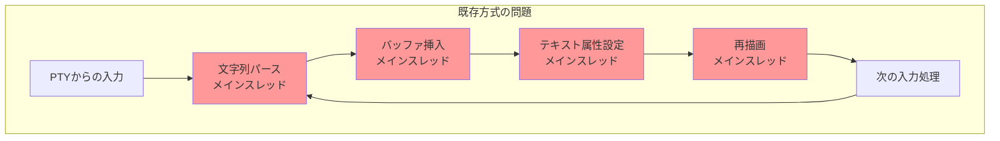
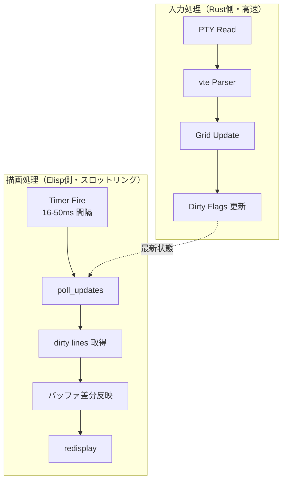
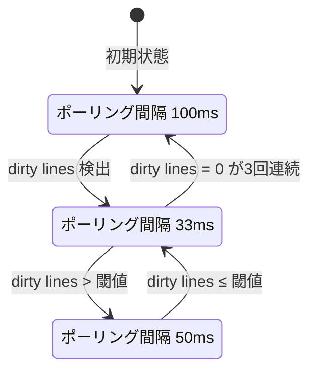
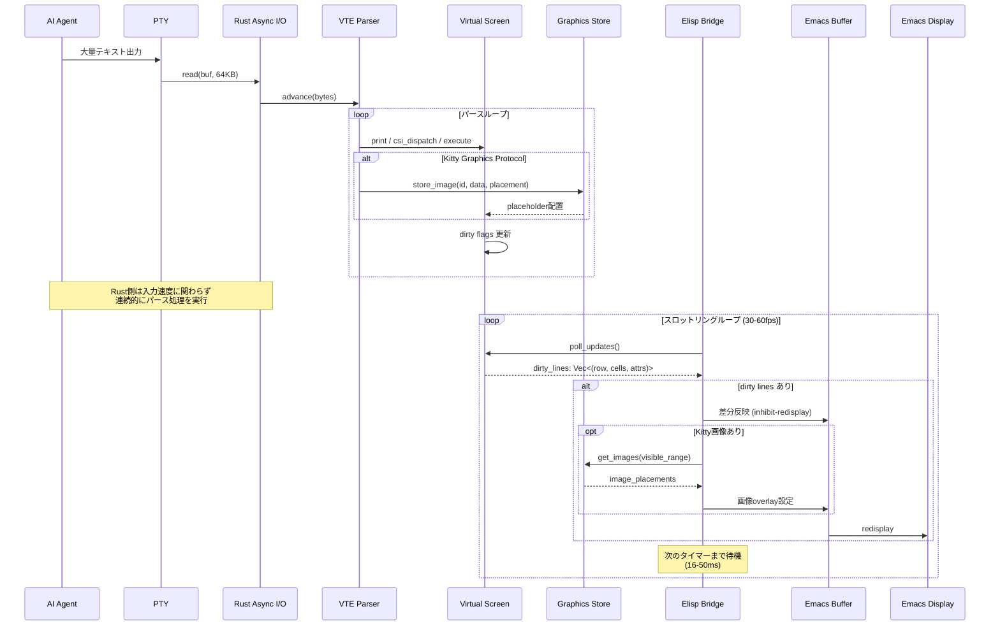

# AI Agent 出力への対応戦略

## 問題定義

Claude Code、Cursor Agent、Aider などの AI Agent は、ターミナル上で大量のテキストを高速に出力する。これらのツールは以下の特性を持つ。

- 数百〜数千行のコード生成を一度に出力する
- プログレスバーやスピナーなどのリッチUI要素を使用する
- 表形式のデータ（ファイルリスト、diff等）を大量に出力する
- 出力速度が人間のタイピングとは桁違いに速い（数MB/s〜数十MB/s）

### 既存ターミナルエミュレータが固まる原因

vterm や eat が AI Agent の高速出力で固まる主な原因は、Emacs のメインスレッドが全ての処理をシングルスレッドで逐次実行するためである。

具体的には以下の処理がメインスレッドを占有する。

1. **パース処理**: 入力バイトの1文字ずつに対して Elisp 関数呼び出し（eat の場合）、または C → Elisp のデータ変換（vterm の場合）が走る
2. **バッファ操作**: `insert`、`delete-region` 等のバッファ操作が大量発生し、各操作ごとにバッファの内部データ構造（gap buffer）が更新される
3. **再描画エンジン**: Emacs の redisplay エンジンがバッファ変更を検知するたびにレイアウト再計算を試みる
4. **GC 圧力**: 大量の一時文字列オブジェクトが生成され、GC が頻繁に走る

これらの処理が高速出力の全バイトに対して律儀に実行されるため、UI が数秒〜数十秒フリーズする。

## バッファ更新と描画のデカップリング

kuro は「パース・状態更新」と「描画」を完全に分離することで、この問題を解決する。

**Rust 側（100MB/s でも処理可能）**: PTY からの入力を Rust スレッドが受け取り、vte パーサーで即座に処理して Grid を更新する。Emacs のメインスレッドとは非同期に動作するため、入力速度に関わらず処理が滞らない。

**Elisp 側（描画サイクル 0.016〜0.05 秒）**: Emacs のタイマーが定期的に `poll_updates` を呼び出し、前回のポーリング以降に変更された行だけを取得してバッファに反映する。タイマー間隔内に蓄積された複数回の更新は、最終状態の1回の描画にまとめられる。

**結果**: Rust 側がどれだけ高速に処理しても、Elisp 側の描画は一定のフレームレートに制限されるため、UI フリーズが回避される。

## スロットリング戦略の詳細アルゴリズム

スロットリングは以下の3段階で動作する。

### 第1段階: 入力バッファリング

PTY からの read はバッファサイズ（例: 64KB）単位で行い、小さな read の繰り返しを避ける。1回の read で得られた全バイトを vte パーサーに一括投入する。

### 第2段階: 適応的ポーリング間隔

- **Idle 状態**: 変更がない場合、ポーリング間隔を 100ms に延長して CPU 使用率を下げる
- **Active 状態**: 通常の変更がある場合、33ms（約30fps）で描画する
- **Burst 状態**: 大量の変更（全行の50%以上が dirty）が検出された場合、50ms に延長してバッチ効率を上げる

### 第3段階: フレームバジェット

1回の描画サイクルに時間制限（フレームバジェット）を設ける。たとえば 16ms 以内に処理しきれない dirty lines がある場合、残りは次のサイクルに持ち越す。これにより、1回の描画が長時間メインスレッドをブロックすることを防ぐ。

## Claude Code 等のリッチUI要素への対応

### プログレスバー

AI Agent のプログレスバーは、同一行をキャリッジリターン（`\r`）で繰り返し上書きする。kuro の Grid では、この操作は「1行の更新」として dirty set に1エントリだけ追加される。100回上書きされても、次のポーリングで返却されるのは最終状態の1行だけであり、極めて効率的に処理される。

### 表形式出力

ファイルリストや diff の表形式出力は、多数の行が一度に挿入される。Grid 内では `Vec<Line>` の末尾追加やスクロール操作として処理され、Rust の `Vec` の amortized O(1) push 操作の恩恵を受ける。dirty set には挿入・変更された全行が記録されるが、スロットリングにより描画回数は制限される。

### Kitty Protocol による Unicode プレースホルダー

Kitty Graphics Protocol は、ターミナル内で画像をインラインで表示するためのプロトコルである。AI Agent の出力に画像が含まれる場合（例: グラフ、スクリーンショット）、vte-graphics v0.15.0 でシーケンスをパースし、画像データを Kitty Graphics Store に保持する。Elisp 側では、Unicode プレースホルダー文字と Emacs の画像表示機能を組み合わせて表示する。

## 詳細シーケンス図

## パフォーマンス目標

| メトリクス | vterm (現状) | eat (現状) | kuro (目標) |
|---|---|---|---|
| パース速度 | libvterm 依存 | Elisp ボトルネック | vte crate (≈Alacritty同等) |
| 描画フレームレート | 可変（フリーズあり） | 可変（フリーズあり） | 安定 30-60fps |
| 高速出力時の CPU | 100%（メインスレッド占有） | 100% | Rust側分離、メインスレッド負荷低 |
| 1MB出力の体感遅延 | 数秒フリーズ | 数秒フリーズ | フリーズなし（描画は遅延） |
