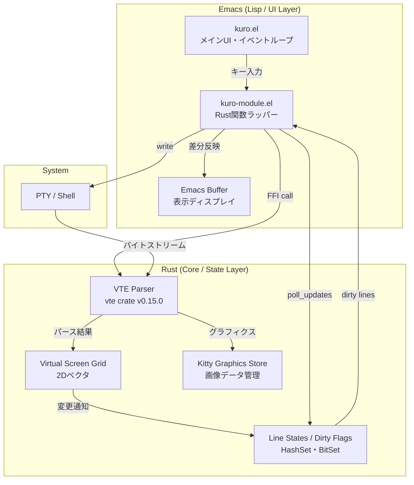
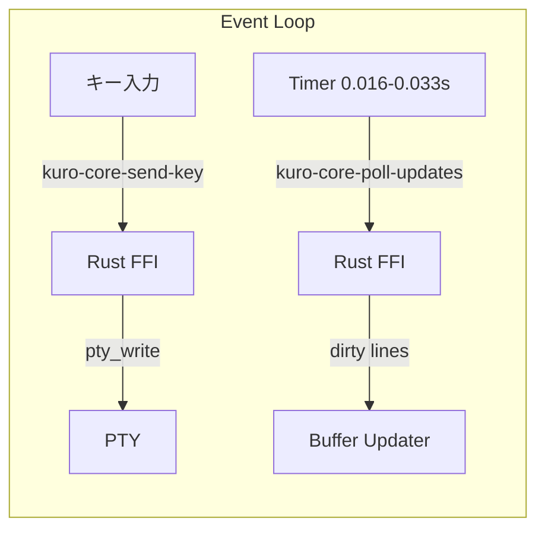
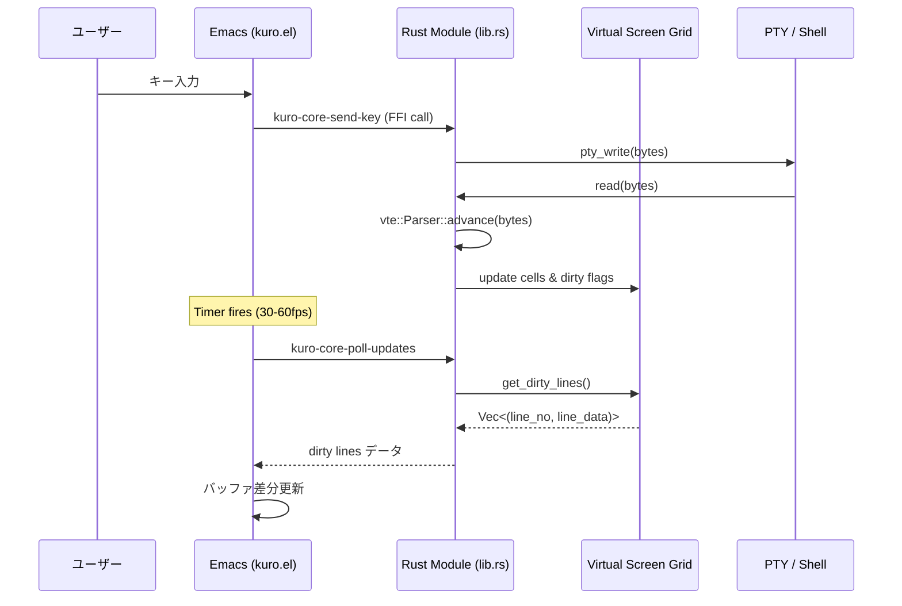

# 全体アーキテクチャ

## Remote Display Model の定義

kuro は **Remote Display Model** というアーキテクチャパターンを採用する。このモデルの本質は「Emacsバッファをただの表示ディスプレイ（View）として使い、ロジックのすべてをRust（Model/Controller）に置く」ことにある。

従来のEmacsターミナルエミュレータ（vterm、eat）では、端末の状態管理とバッファへの反映が密結合しており、高速出力時にEmacsのメインスレッドがボトルネックとなっていた。kuro ではこの構造を根本的に分離し、Rust側に完全な仮想スクリーンを持たせ、Elisp側はその「スナップショット」を描画するだけの薄いレイヤーとして機能する。

この設計は vterm（emacs-libvterm）で実証済みの dirty-line polling パターンを踏襲しつつ、C の代わりに Rust を採用することで、メモリ安全性と高パフォーマンスの両立を図る。

## レイヤー構成



## Rust側コンポーネント一覧

### PTY Stream Parser

vte crate v0.15.0（Alacrittyプロジェクト製）を使用する。vte は table-driven state machine として実装されており、入力バイトストリームをゼロコピーでパースする。`Perform` トレイトの以下のコールバックを実装することで、端末シーケンスの処理をフックする。

- `print` -- 通常文字の出力
- `execute` -- C0/C1制御文字の実行
- `csi_dispatch` -- CSIシーケンスの処理（カーソル移動、消去、SGR等）
- `osc_dispatch` -- OSCシーケンスの処理（タイトル変更等）
- `esc_dispatch` -- エスケープシーケンスの処理

Kitty Graphics Protocol 対応には vte-graphics v0.15.0（vte のフォーク）を使用し、画像シーケンスの解析も行う。

### Virtual Screen Grid

端末の画面状態を `Vec<Line>` として管理する。各 `Line` は `Vec<Cell>` と `is_dirty` フラグを保持し、各 `Cell` は文字コードポイント、SGR属性（前景色・背景色・太字・イタリック等）を保持する。カーソル位置、スクロール領域、代替スクリーン（alternate screen）もこのコンポーネントが管理する。

### Dirty Line Tracker

画面更新を最小化するために、変更された行番号を `HashSet<usize>` または `BitSet` で追跡する。Elisp側が `poll_updates` を呼び出した際に、dirty lines の一覧と対応する行データのみを返却し、その後 dirty set をクリアする。

### Kitty Graphics Store

Kitty Graphics Protocol で送られた画像データを管理する。画像ID、配置位置、ピクセルデータを保持し、Elisp側での表示に必要な情報を提供する。

## Elisp側コンポーネント一覧

### Event Loop（kuro.el）

ユーザーのキー入力をキャプチャし、Rust FFI 経由で PTY に書き込む。タイマーベースのポーリングループ（`run-with-timer`）により、定期的に Rust 側の更新状態を確認する。



### Buffer Updater（kuro-module.el）

Rust 関数のラッパーとして動作し、`poll_updates` から返された dirty lines のデータをバッファに差分反映する。全バッファの書き換えではなく、変更行のみをテキストプロパティ付きで更新する。

## モノレポ構成

```
kuro/
├── rust-core/          # Rust側のロジック
│   ├── src/
│   │   ├── lib.rs      # Emacs FFI 窓口
│   │   ├── grid.rs     # 仮想スクリーン管理
│   │   └── parser.rs   # vte + kittyプロトコル
│   └── Cargo.toml
└── emacs-lisp/         # Elisp側の表示層
    ├── kuro.el         # メインUI
    └── kuro-module.el  # Rust関数のラッパー
```

- **rust-core/**: Rust ダイナミックモジュール（`.so` / `.dylib`）をビルドする Cargo プロジェクト。`crate-type = ["cdylib"]` を指定し、Emacs から `module-load` で読み込む。
- **emacs-lisp/**: Elisp パッケージ。`kuro.el` がユーザー向けコマンドとモード定義を提供し、`kuro-module.el` が Rust 側の `#[defun]` 関数をラップする。

## データフロー概要


