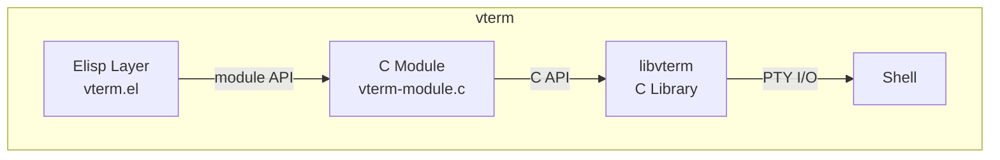
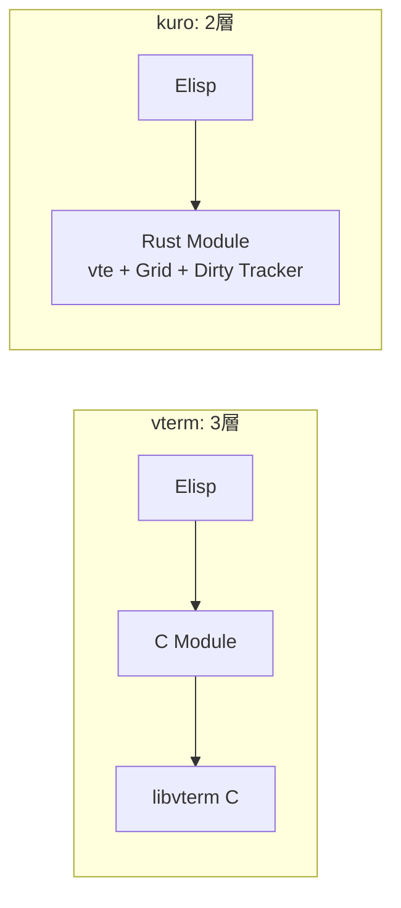
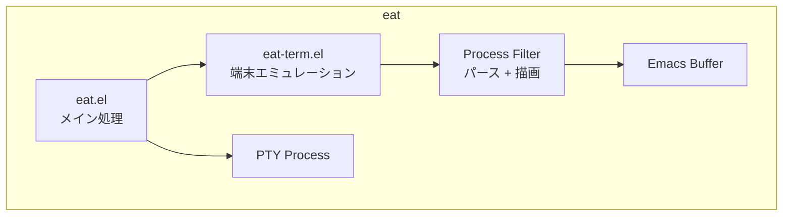
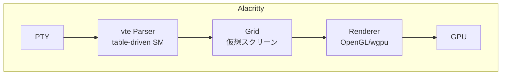
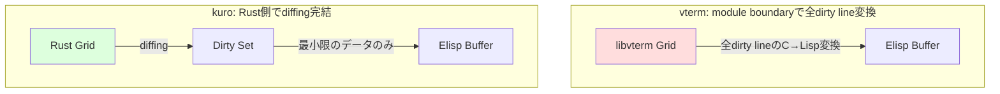
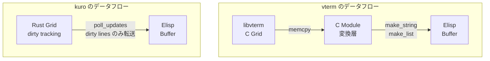

# 既存ターミナルエミュレータとの比較

## 概要

本文書では、kuro の設計を既存のターミナルエミュレータと比較し、差別化ポイントを明確にする。Emacs 内ターミナル（vterm、eat）と、スタンドアロンターミナル（Alacritty、Foot）の両方を対象とする。

## vterm (emacs-libvterm)

### アーキテクチャ

vterm は 3 層構造を持つ。

- **Elisp Layer (vterm.el)**: ユーザーインターフェースとキーバインド
- **C Module (vterm-module.c)**: Emacs Dynamic Module として実装、libvterm と Emacs buffer の橋渡し
- **libvterm**: Paul Evans による端末エミュレーションライブラリ（Pure C）

### ボトルネック

vterm のパフォーマンスボトルネックは module API 境界でのデータ変換にある。libvterm の内部状態（C 構造体）を Emacs の Lisp オブジェクト（文字列、リスト等）に変換する際にコピーが発生し、特に画面全体を更新する場合にコストが高い。

dirty-line polling パターンを採用しているが、dirty line のデータを Elisp に渡す際の変換処理が効率的とは言えない。

### 問題点

- **フリッカー**: 画面更新時に部分的な描画状態がユーザーに見えることがある
- **高速出力時の CPU 100%**: AI Agent などの大量出力でメインスレッドが占有され、UI がフリーズする
- **スクロール不可**: 代替スクリーン（alternate screen）でのスクロールに制限がある
- **スループット**: bare terminal（Alacritty等）と比較して 3-4 倍遅い

### kuro との構造比較

kuro は C module と libvterm の2層を Rust module の1層に統合する。これにより、C → Elisp のデータ変換コストが排除され、Rust 内部で Grid 管理から dirty tracking まで一貫して処理できる。

## eat (Emulate A Terminal)

### アーキテクチャ

eat は Pure Elisp で実装されたターミナルエミュレータである。

外部ライブラリへの依存がなく、Emacs さえあれば動作する。インストールと設定が簡単であり、ポータビリティが高い。

### 強み

- **anti-flicker heuristics**: Suckless Terminal（st）由来のアンチフリッカー手法を Elisp で実装。出力バッチの途中で redisplay をトリガーせず、バッチ完了後にまとめて描画する
- **依存関係なし**: Pure Elisp のため、コンパイル不要、外部ライブラリ不要
- **メンテナンス性**: Elisp のみで構成されるため、Emacs コミュニティ内で保守しやすい

### 限界

- **Elisp ランタイムの性能天井**: Elisp はインタプリタ言語であり、バイトコードコンパイルしてもネイティブ言語の性能には遠く及ばない。端末パーサーのような CPU バウンドな処理には根本的に不向き
- **パフォーマンス**: vterm と比較して約 1.5 倍遅い（vterm 自体がネイティブターミナルの 3-4 倍遅いため、eat はネイティブの約 5-6 倍遅い計算になる）
- **GC 圧力**: 大量の文字列操作が Elisp ヒープに負荷をかけ、GC ポーズが発生する

## Alacritty

### アーキテクチャ

Alacritty はスタンドアロンのGPUアクセラレーテッドターミナルエミュレータであり、kuro が使用する vte crate の出自でもある。

- **vte crate**: Alacritty 内部で開発・使用されている table-driven state machine パーサー。kuro が採用するのと同じクレート
- **GPU accelerated rendering**: GPU アクセラレーテッドレンダリング (OpenGL/wgpu) により、描画を CPU から完全にオフロード
- **Rust zero-cost abstractions**: 全体が Rust で書かれており、抽象化によるランタイムオーバーヘッドがない

Alacritty は kuro にとって「パース層のリファレンス実装」であり、vte crate の使用方法やパフォーマンス特性を理解する上で参考になる。ただし、Alacritty は GPU レンダリングを持つスタンドアロンアプリケーションであり、Emacs 内で動作する kuro とは描画アーキテクチャが根本的に異なる。

## Foot

### アーキテクチャ

Foot は Wayland 専用の軽量ターミナルエミュレータである。

- **PGO 最適化パーサー**: Profile-Guided Optimization（PGO）を適用した自作パーサーにより、高いスループットを達成
- **Damage tracking**: 変更されたセルのみを再描画する仕組み（CPU ベース）。GPU ではなく CPU で差分計算を行い、Wayland のダメージ領域 API を活用して効率的に描画する
- **Wayland 専用**: X11 をサポートせず、Wayland に特化することで実装をシンプルに保っている

kuro の dirty line tracking は Foot の damage tracking と概念的に類似しているが、粒度が異なる（kuro は行単位、Foot はセル単位）。

## kuro の差別化

### 比較表

| 項目 | vterm | eat | kuro |
|---|---|---|---|
| パーサー | libvterm (C) | Elisp | vte (Rust) |
| 描画層 | C module + Elisp | Pure Elisp | Rust diffing + Elisp |
| 更新方式 | dirty line refresh + C→Elisp変換 | バッチ / 合体 | Rust側diffing + バッチ |
| フリッカー | あり | 最小（anti-flicker） | 最小（目標） |
| スループット | ベースの3-4x遅い | vterm比1.5x遅い | vterm超え（目標） |
| 高速出力時 | UIフリーズ | UIフリーズ | スロットリングで回避（目標） |
| Kitty Graphics | 非対応 | 非対応 | 対応（目標） |
| 依存関係 | libvterm + CMake | なし | Rust toolchain |
| メモリ安全性 | C（手動管理） | Elisp（GC） | Rust（所有権システム） |

### 最大の差別化ポイント

kuro の最大の差別化は **module boundary を越えるデータ量の最小化** にある。

vterm では libvterm が管理する Grid の dirty lines を C module 層で Lisp オブジェクトに変換する必要があり、ここにコピーコストが発生する。kuro では Rust 側で diffing が完結し、`poll_updates` を通じて dirty lines のデータのみを Lisp オブジェクトとして返却する（minimal-copy diff-based transfer）。Elisp 側に渡されるのは「変更された行番号」と「その行の最終状態」だけであり、全 Grid データの変換は発生しない。

### アーキテクチャレベルの優位性

この差は少量の出力では体感しにくいが、AI Agent のような大量出力シナリオでは劇的な差として現れる。1MB の出力に対して、vterm は全データの C → Lisp 変換を行うのに対し、kuro は dirty lines のみを Lisp オブジェクトに変換して返却するため、module boundary を越えるデータ量が大幅に削減される。
