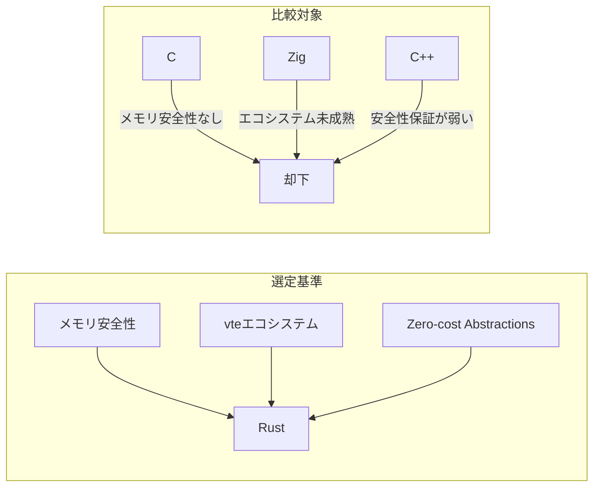
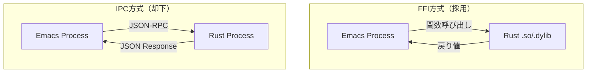
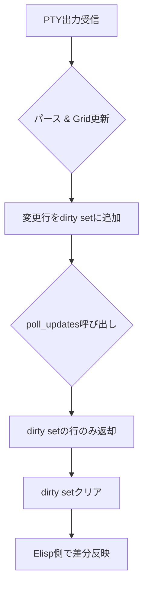
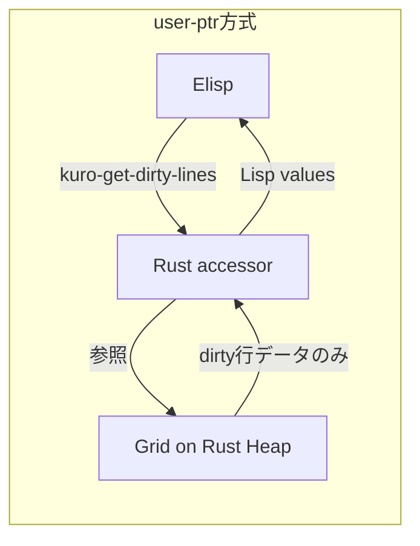
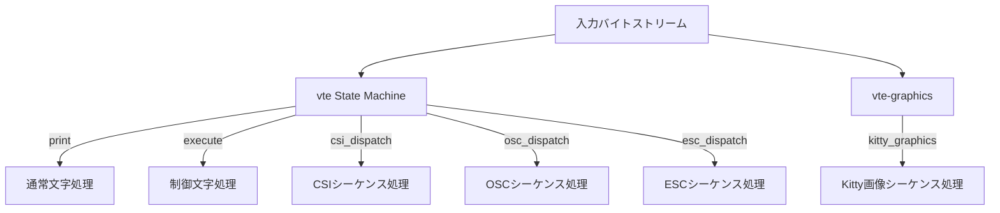

# 設計判断とトレードオフ

## なぜ Rust か

kuro のコアロジックに Rust を選定した理由は、以下の3つの要素が揃っているためである。

**メモリ安全性**: ターミナルエミュレータは外部から送られる任意のバイト列を処理するため、バッファオーバーフローや use-after-free などのメモリ安全性バグが致命的な影響を与え得る。Rust の所有権システムは、これらのバグをコンパイル時に排除する。C で書かれた libvterm にも過去にメモリ関連のバグが報告されており、この選択は実践的な意味を持つ。

**vte / Alacritty エコシステム**: Alacritty プロジェクトが開発・メンテナンスする vte crate v0.15.0 は、本番環境で広く使われている table-driven state machine パーサーである。ゼロから端末パーサーを書く代わりに、この実績あるクレートを利用できることは大きなアドバンテージである。

**Zero-cost abstractions**: Rust のジェネリクスやトレイトは実行時コストを伴わない。抽象化を重ねてもパフォーマンスが劣化しないため、コードの保守性と実行速度を両立できる。

## なぜ Emacs Dynamic Module (FFI) か

kuro は Emacs Dynamic Module API を用いた in-process FFI 方式を採用する。これはプロセス間通信（IPC）ベースの代替案（JSON-RPC、gRPC、Unix socket 等）と比較して以下の優位性がある。

| 比較項目 | FFI (Dynamic Module) | IPC (JSON-RPC等) |
|---|---|---|
| レイテンシ | ナノ秒オーダー（関数呼び出し） | マイクロ〜ミリ秒オーダー（シリアライズ + ソケット通信） |
| データ受け渡し | ポインタ共有（user-ptr）、コピー不要 | シリアライズ/デシリアライズが必須 |
| プロセス管理 | 不要（同一プロセス） | 子プロセスのライフサイクル管理が必要 |
| デバッグ | Rust側のpanicがEmacsを巻き込む | プロセス分離で堅牢 |
| デプロイ | .so/.dylibファイル1つ | 別バイナリの配布が必要 |

ターミナルエミュレータでは描画サイクルごとに大量のデータ受け渡しが発生するため、レイテンシとデータ転送コストが支配的になる。FFI方式のナノ秒オーダーのオーバーヘッドは、IPC方式と比較して桁違いに有利である。

デメリットとして、Rust側のpanic（未捕捉の場合）がEmacsプロセス全体をクラッシュさせるリスクがある。これは `std::panic::catch_unwind` で緩和する。

## なぜ dirty line tracking か

画面更新のアプローチとして、全バッファ書き換えと dirty line tracking を比較する。

**全バッファ書き換え**: 行数を R、列数を C とすると、毎回 O(R * C) のコストがかかる。80x24 の端末では 1,920 セルだが、200x50 では 10,000 セル、そのうち実際に変更されたのが数行であっても全体を書き換える。

**dirty line tracking**: 変更された行数を D とすると O(D * C) のコスト。1%の行が変更されれば1%のコストで済む。高速出力時は D が R に近づくが、一般的な対話操作では D << R である。

vterm もこの dirty-line polling パターンを C で実装しており、有効性が実証されている。kuro はこれを Rust で再実装しつつ、さらに差分の粒度を細かくする余地を持つ。

## user-ptr vs シリアライズ

Grid データを Elisp 側に渡す方法として、2つの戦略を比較した。

| 比較項目 | user-ptr（推奨） | シリアライズ（非推奨） |
|---|---|---|
| データ配置 | Rust ヒープ上に保持 | Elisp ヒープにコピー |
| アクセス方式 | accessor 関数（`kuro-get-line` 等）でオンデマンド取得 | 毎回 `Vec` → Lisp list 変換 |
| メモリ効率 | Grid は1コピーのみ | 毎回全データのコピーが発生 |
| GC への影響 | Rust 側で管理、Emacs GC に負荷なし | 大量の Lisp オブジェクトが GC 対象に |
| 実装複雑度 | `user-ptr` + `#[defun]` で自然に実装 | 変換コード + エラーハンドリングが必要 |

**採用方針**: user-ptr パターンを全面的に採用する。emacs-module-rs（emacs crate）v0.19.0 が提供する `user-ptr` マクロにより、Rust 構造体を Emacs の opaque pointer として公開できる。Elisp 側からは accessor 関数を通じて必要なデータだけを取得する。

## emacs-module-rs 選定リスク

emacs-module-rs（crates.io の `emacs` crate）v0.19.0 は、Emacs Dynamic Module API の Rust バインディングとして事実上の標準的な選択肢である。しかし以下のリスクを認識しておく必要がある。

**メンテナンス状況**: 本クレートは largely unmaintained の状態にある。新規の機能追加やバグ修正は期待しにくい。

**ABI 安定性**: Emacs Dynamic Module API 自体は ABI が安定しており（Emacs 25 以降で後方互換）、emacs-module-rs が wrap している C API レイヤーに破壊的変更が入るリスクは低い。つまり、クレートのメンテナンスが停滞していても、既存の機能は動作し続ける可能性が高い。

**代替戦略**: 万が一 emacs-module-rs が使えなくなった場合、raw FFI（`emacs_module.h` を直接 `bindgen` で Rust バインディング化）にフォールバックできる。実装コストは増えるが、技術的には可能である。

**リスク緩和策**:
- emacs-module-rs の API 表面に対して薄い abstraction layer を設け、将来の差し替えを容易にする
- CI で複数の Emacs バージョン（27, 28, 29, 30）に対してテストを実行する
- クレートのフォークを準備し、必要に応じてパッチを当てられるようにする

## vte vs 自作パーサー

端末エスケープシーケンスのパーサーとして、vte crate を採用し自作パーサーは作らない。

**vte crate の実績**: Alacritty という本番環境で広く使われるターミナルエミュレータで使用されており、膨大なエッジケースが実戦でテスト済みである。VT100/VT220/xterm の互換性は非常に複雑であり、自作パーサーでこのレベルの互換性を達成するには多大な工数を要する。

**table-driven state machine**: vte は Paul Williams の ANSI-compatible terminal parser state machine を Rust で実装したものである。状態遷移テーブルを事前計算しており、パース処理で条件分岐が最小化されている。これにより、CPU の分岐予測ミスが減り、高いスループットを実現する。

**Kitty Graphics Protocol**: 標準の vte crate では Kitty Graphics Protocol をサポートしていないため、vte-graphics v0.15.0（vte のフォーク）を併用する。このフォークは Kitty 固有のシーケンスをパースするために必要な拡張を提供する。

