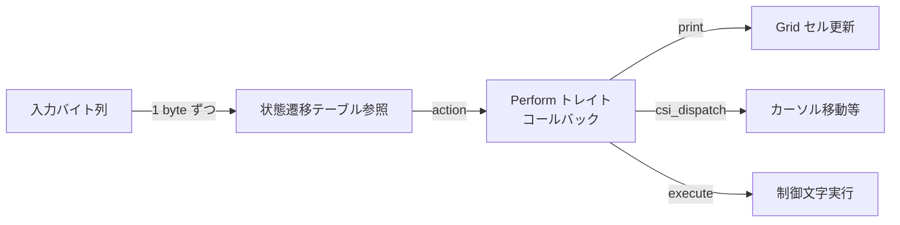
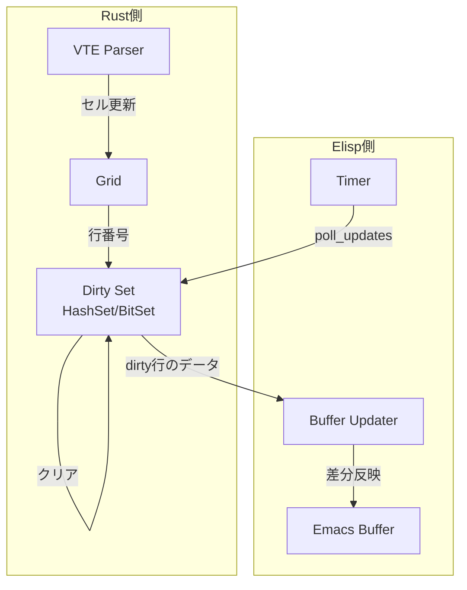
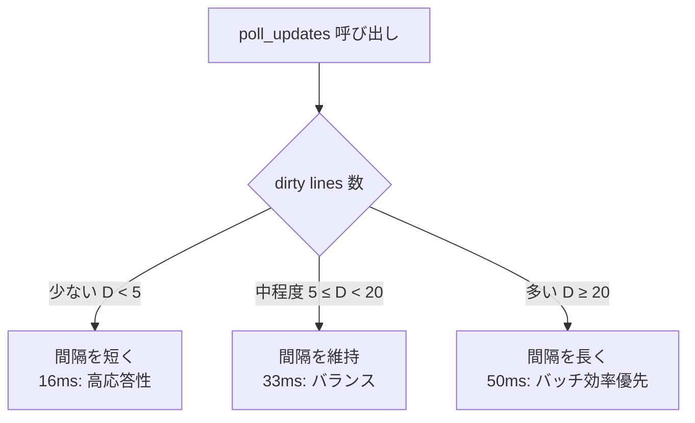
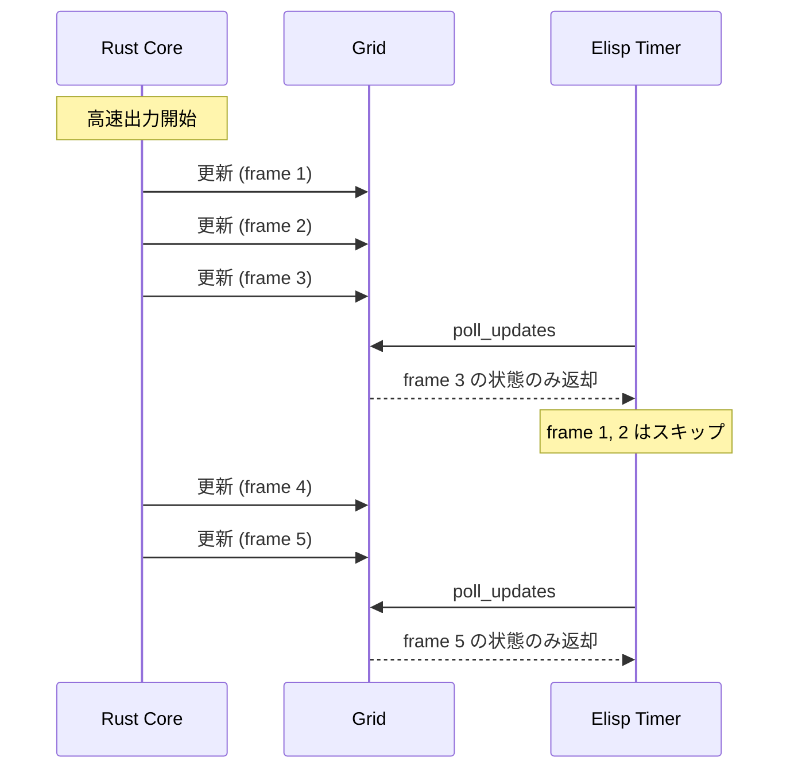
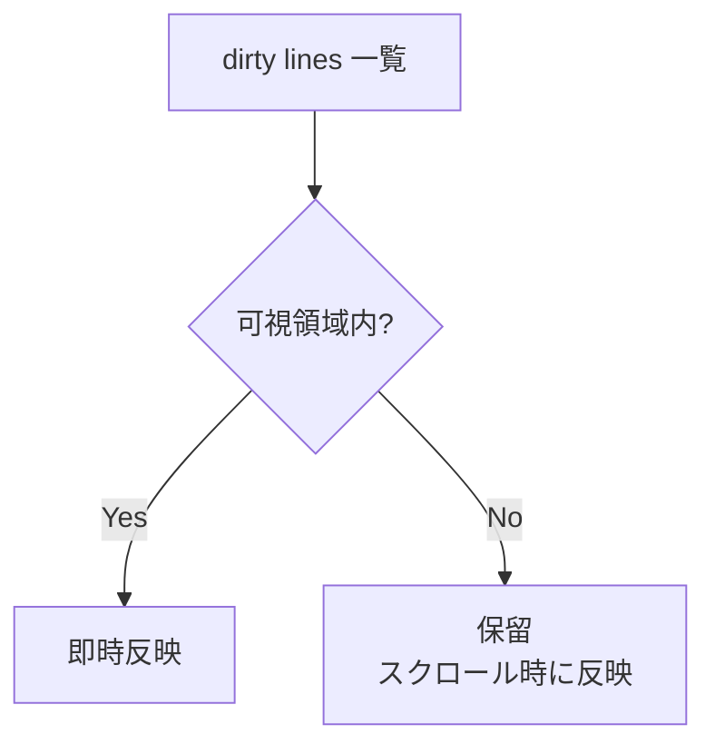

# パフォーマンス戦略

## 概要

kuro のパフォーマンス戦略は「Rust 側で可能な限り処理を完結させ、Emacs に渡すデータ量を最小化する」という原則に基づく。この文書では、各最適化手法の背景と仕組みを解説する。

## Zero-Copy パース

vte crate v0.15.0 は table-driven state machine として実装されている。入力バイト列を1バイトずつ状態遷移テーブルで処理し、対応するアクション（`print`、`execute`、`csi_dispatch` 等）をコールバックする。

この設計の利点は以下の通りである。

- **分岐の最小化**: `match` や `if-else` チェーンの代わりにテーブル参照で状態遷移を決定するため、CPU の分岐予測ミスが抑制される
- **ゼロコピー**: パーサーは入力バッファのスライス参照をコールバックに渡すだけであり、中間バッファへのコピーが発生しない
- **キャッシュ効率**: 状態遷移テーブルは小さく、L1 キャッシュに収まる

## Dirty Line Tracking

画面更新コストを劇的に削減する中核メカニズムである。

Rust 側の Virtual Screen Grid は、各行が変更されたかどうかを `HashSet<usize>` または `BitSet` で追跡する。VTE パーサーが Grid のセルを更新するたびに、その行番号が dirty set に追加される。

Elisp 側が `poll_updates` を呼び出すと、dirty set に含まれる行のデータのみが返却され、dirty set はクリアされる。

**計算量の比較**:
- 全バッファ書き換え: O(R * C)（R=行数、C=列数）
- dirty line tracking: O(D * C)（D=変更行数）

たとえば 200 行の画面で 2 行だけ変更された場合、データ転送量は 1/100 になる。

## スロットリング

AI Agent（Claude Code 等）が大量の出力を一度に送信する場合、Rust 側は全バイトを高速にパースして Grid を更新し続けるが、Elisp 側の描画はフレームレートに基づいてスロットリングされる。

**フレームレート制御**: Elisp 側のタイマーを 16ms（約60fps）〜 33ms（約30fps）の間隔で設定する。1回のポーリングで Rust 側に蓄積された全変更が1つのスナップショットとして取得される。

**適応的スロットリング**: 出力速度に応じてポーリング間隔を動的に調整する。

## ドロップフレーム

高速出力時に、すべての中間状態を描画する必要はない。Rust 側が複数回 Grid を更新しても、Elisp 側が次にポーリングした時点の最終状態だけが描画される。

中間状態は自動的にスキップされる。たとえば AI Agent が 1000 行を 0.1 秒で出力した場合、30fps なら 3 フレーム分の描画で済む。各フレームでは「前回ポーリング以降の全変更が反映された Grid」のスナップショットが取得されるため、最終結果は正しい。

## Lazy Rendering

画面外の行（スクロールバック履歴やバッファの可視領域外）は即時描画の対象外とする。

**可視領域（visible region）のみ即時反映**: Emacs の `window-start` / `window-end` の範囲内にある dirty lines だけを優先的に反映する。スクロールバック領域の更新は、ユーザーがスクロールした時点でオンデマンドに実行する。

これにより、大量のスクロールバック出力があっても描画コストは可視領域に比例する定数となる。

## GC 対策

Emacs の GC（ガベージコレクション）は mark-and-sweep 方式であり、Lisp ヒープ上のオブジェクト数に比例してポーズが長くなる。kuro ではバイナリデータ（Grid セル、画像データ等）を Rust ヒープに隔離することで、Emacs GC への影響を最小化する。

**user-ptr による隔離**: Grid 構造体全体を `user-ptr` としてラップする。Emacs から見ると単一の opaque pointer でしかなく、GC が走査するオブジェクト数は増えない。Grid 内部の数千〜数万のセルは Rust のメモリアロケータが管理し、Emacs GC の対象外となる。

**一時オブジェクトの最小化**: `poll_updates` の返却値として Lisp 文字列やリストを生成する際も、dirty lines の数に比例する最小限のオブジェクトのみを作成する。

## 文字列処理の回避

Elisp の文字列操作（`concat`、`substring`、`insert` 等）は、不変文字列のコピーを伴うため重い。kuro では、端末の行データの構築・更新を Rust 内のベクタ操作に置き換える。

**Rust 側**: `Vec<Cell>` を直接操作。文字挿入・削除・属性変更は in-place で行われ、不要なアロケーションが発生しない。

**Elisp 側**: Rust から受け取った行データを `insert` でバッファに一度だけ書き込む。Elisp 内で文字列の切り貼りは行わない。

## Overlays vs Text Properties

端末出力の色やスタイル（SGR 属性）をバッファに反映する方法として、Overlays と Text Properties の選択がある。

| 比較項目 | Overlays | Text Properties |
|---|---|---|
| パフォーマンス | O(n) の走査コスト（n=overlay数） | O(1) のアクセス |
| 大量使用時 | 著しく劣化（数千個以上で顕著） | 安定 |
| 動的変更 | overlay の移動・削除が容易 | テキスト範囲と結合、位置管理が暗黙的 |

**採用方針**: Text Properties を基本とする。行全体を置換する kuro の更新方式では、行ごとに propertize した文字列を insert するため、Text Properties の方が自然かつ効率的である。Overlays は行をまたぐ装飾や一時的なハイライトなど、限定的な用途にのみ使用する。
