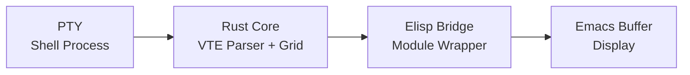
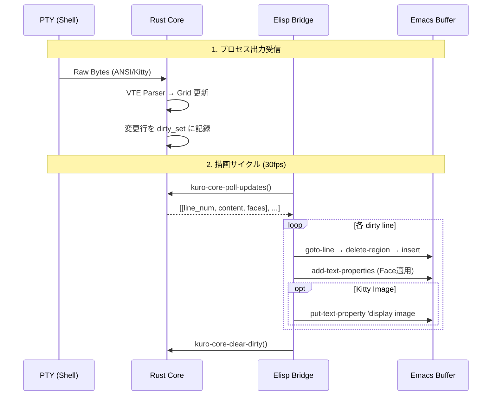
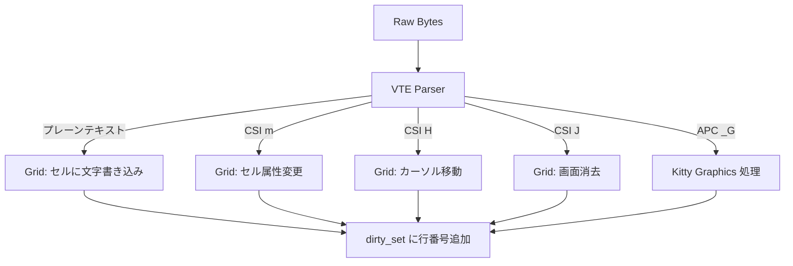
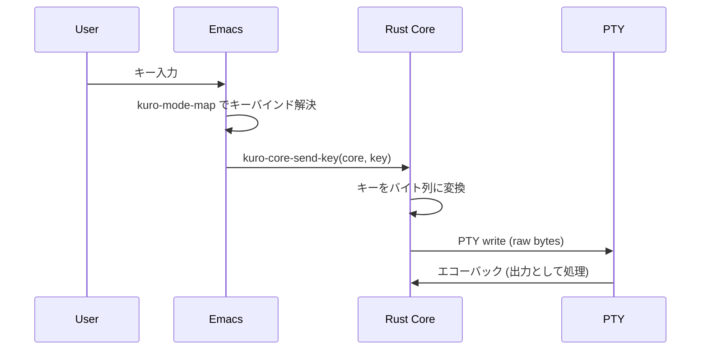
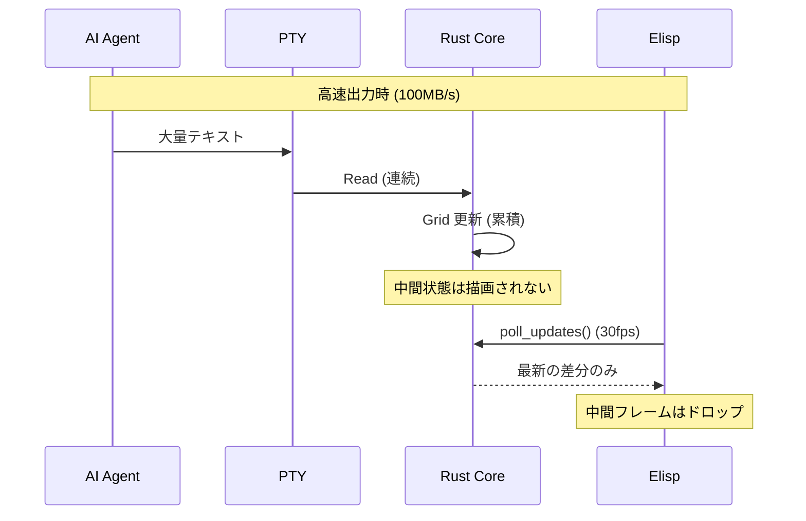
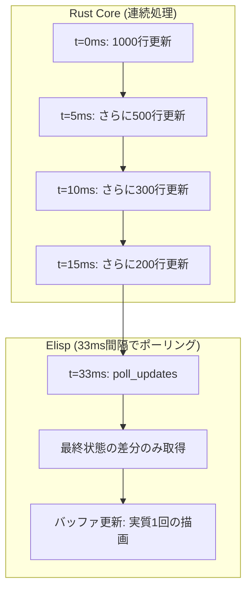
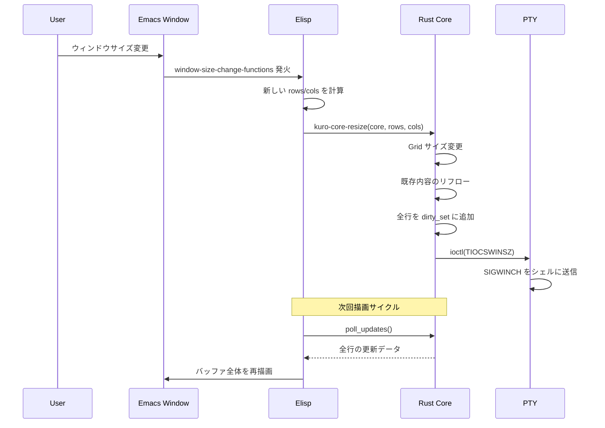
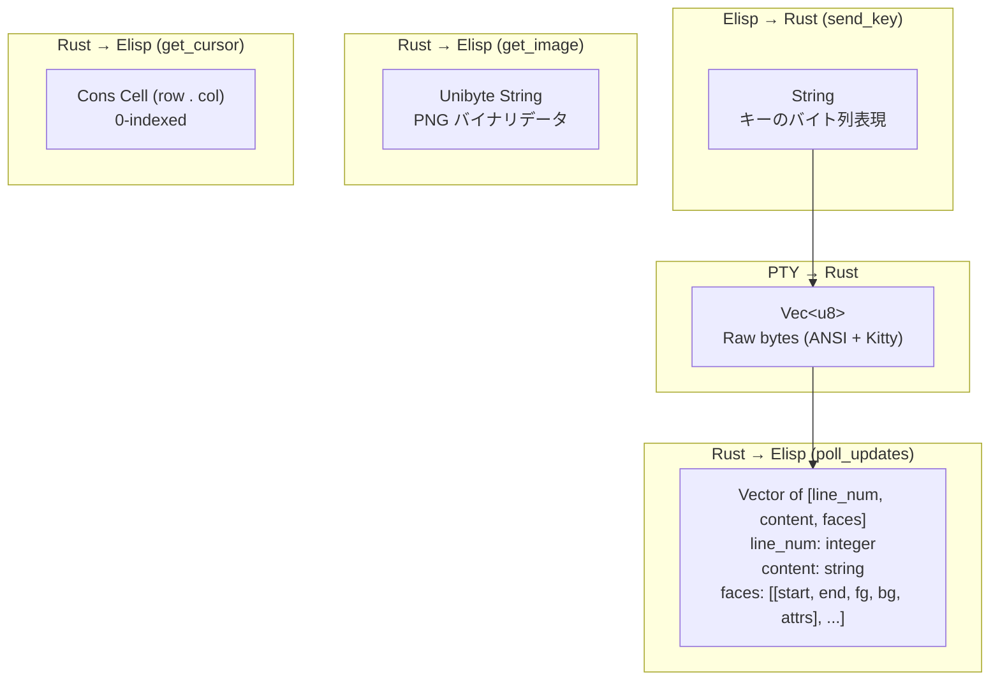

# データフロー定義

## 概要

本ドキュメントは、PTY (シェルプロセス) から Emacs バッファに至るまでの**エンドツーエンドのデータフロー**を定義する。kuro のアーキテクチャでは、データは以下の 4 つのレイヤーを通過する。



| レイヤー | 責務 | 言語 |
|---|---|---|
| PTY | シェルプロセスとの I/O | OS |
| Rust Core | VTE パース、グリッド管理、ダーティ追跡 | Rust |
| Elisp Bridge | Rust 関数の呼び出し、ポーリング | Elisp |
| Emacs Buffer | テキスト表示、Face 適用、画像表示 | Elisp |

## メインデータフロー: プロセス出力 → バッファ描画

ターミナルアプリケーションの出力がバッファに表示されるまでの標準的なフロー。



### ステップ詳細

#### 1. プロセス出力受信

PTY マスター fd から読み取ったバイト列が Rust Core に渡される。

```
PTY fd → read() → Vec<u8> (raw bytes)
```

バイト列には以下が含まれる可能性がある:

- プレーンテキスト (UTF-8)
- ANSI エスケープシーケンス (CSI, OSC, DCS)
- Kitty Graphics Protocol (APC エスケープ)

#### 2. VTE パース → Grid 更新

Rust の VTE パーサーがバイト列を解析し、仮想グリッドを更新する。



#### 3. ポーリングと描画

Elisp の描画ループ (30fps) が Rust Core をポーリングし、差分データを取得する。

```elisp
;; Rust から返されるデータ構造
;; updates: [[0 "hello world" [[0 5 "#FF0000" nil 1] [6 11 nil nil 0]]]
;;           [3 "$ ls -la"    [[0 1 "#00FF00" nil 1] [2 8 nil nil 0]]]]
```

#### 4. バッファ更新

各 dirty 行に対して以下の操作を実行:

1. `goto-char` + `forward-line` で対象行に移動
2. `delete-region` で行の内容を消去
3. `insert` で新しい内容を挿入
4. `add-text-properties` で Face を適用
5. 画像がある場合は `put-text-property 'display` で表示

## キー入力フロー

ユーザーのキー入力がシェルに送信されるまでの逆方向フロー。



### キー変換テーブル

Emacs のキーイベントを PTY に送信するバイト列に変換する。

| Emacs キー | 送信バイト列 | 説明 |
|---|---|---|
| 通常文字 | その文字の UTF-8 | 例: `"a"` → `0x61` |
| `RET` | `\r` (0x0D) | キャリッジリターン |
| `TAB` | `\t` (0x09) | タブ |
| `DEL` | `\x7f` | バックスペース |
| `<up>` | `\e[A` | カーソル上 |
| `<down>` | `\e[B` | カーソル下 |
| `<right>` | `\e[C` | カーソル右 |
| `<left>` | `\e[D` | カーソル左 |
| `C-c` | `\x03` | SIGINT |
| `C-d` | `\x04` | EOF |
| `C-z` | `\x1a` | SIGTSTP |

## Kitty Graphics フロー

Kitty Graphics Protocol による画像表示のデータフロー。

```mermaid
sequenceDiagram
    participant P as PTY
    participant R as Rust Parser
    participant G as GraphicsStore
    participant E as Elisp
    participant B as Buffer

    P->>R: \e_G...;[Base64]\e\
    R->>R: APC escape 検知
    R->>G: Base64 デコード → ImageData 保存
    R->>R: Grid に ImagePlacement 配置
    R->>R: dirty_set に該当行を追加

    E->>R: poll_updates()
    R-->>E: image_ref(id, row, col) 含む更新データ
    E->>R: kuro-core-get-image(core, id)
    R-->>E: PNG バイナリデータ
    E->>B: create-image → put-text-property 'display
```

### GraphicsStore のデータ構造

```
// 簡略化した構造。完全な定義は kitty-graphics.md を参照。
GraphicsStore {
    images: HashMap<ImageId, ImageData>,
}

ImageData {
    format: ImageFormat,    // RGB, RGBA, PNG
    data: Vec<u8>,          // デコード済みバイナリ
    width: u32,             // ピクセル幅
    height: u32,            // ピクセル高さ
}

ImagePlacement {
    image_id: ImageId,
    row: usize,             // 配置行 (グリッド座標)
    col: usize,             // 配置列 (グリッド座標)
    width: usize,           // 占有列数 (セル単位)
    height: usize,          // 占有行数 (セル単位)
}
```

### Kitty Graphics Protocol メッセージ形式

```
ESC _ G <control_data> ; <payload> ESC \
```

| フィールド | 説明 |
|---|---|
| `a=` | アクション (`t`: 転送, `p`: 配置, `d`: 削除) |
| `f=` | フォーマット (`24`: RGB, `32`: RGBA, `100`: PNG) |
| `i=` | 画像 ID |
| `payload` | Base64 エンコードされた画像データ |

## スロットリング時のフロー

AI エージェントやパイプラインからの高速出力時に、描画が追いつかない場合のフロー。



### フレームドロップの仕組み



この仕組みにより、Rust Core は受信レートに関係なく連続的にグリッドを更新し、Elisp 側は最新のスナップショットのみを取得する。中間フレームは自然にドロップされ、CPU 使用率を抑える。

### スロットリングの効果

| シナリオ | PTY 受信レート | 実際の描画レート | ドロップ率 |
|---|---|---|---|
| 通常のシェル操作 | < 1KB/s | 30fps (上限) | 0% |
| `ls -la` (大量ファイル) | ~1MB/s | 30fps | ~90% |
| `cat large_file.txt` | ~100MB/s | 30fps | ~99.9% |
| AI エージェント出力 | ~10MB/s | 30fps | ~99% |

## リサイズフロー

Emacs ウィンドウのサイズ変更がターミナルに反映されるまでのフロー。



### リサイズ処理の詳細

```elisp
(defun kuro--window-size-changed (window)
  "ウィンドウサイズ変更時のハンドラ。"
  (when (and (eq (window-buffer window) (current-buffer))
             kuro--core)
    (let ((rows (window-body-height window))
          (cols (window-body-width window)))
      (kuro-core-resize kuro--core rows cols))))

;; フックに登録
(add-hook 'window-size-change-functions #'kuro--window-size-changed)
```

### リサイズ時の Grid リフロー

| 操作 | 説明 |
|---|---|
| 幅の縮小 | 長い行を折り返し、行数が増加する可能性 |
| 幅の拡大 | 折り返しを解除、行数が減少する可能性 |
| 高さの縮小 | スクロールバック領域に行を退避 |
| 高さの拡大 | スクロールバック領域から行を復元 (可能な場合) |
| 全行 dirty 化 | リフロー後にすべての行を dirty としてマーク |

## データ形式サマリー

各レイヤー間で受け渡されるデータの形式をまとめる。



| 方向 | 関数 | データ型 | 内容 |
|---|---|---|---|
| PTY → Rust | `read()` | `Vec<u8>` | 生のバイト列 |
| Rust → Elisp | `poll_updates` | `vector \| nil` | dirty 行の差分データ |
| Elisp → Rust | `send_key` | `string` | キーのバイト列 |
| Elisp → Rust | `resize` | `integer` x 2 | (rows, cols) |
| Rust → Elisp | `get_cursor` | cons cell | (row . col) |
| Rust → Elisp | `get_image` | unibyte string | PNG バイナリ |
