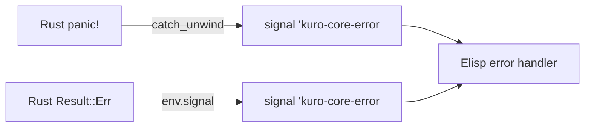
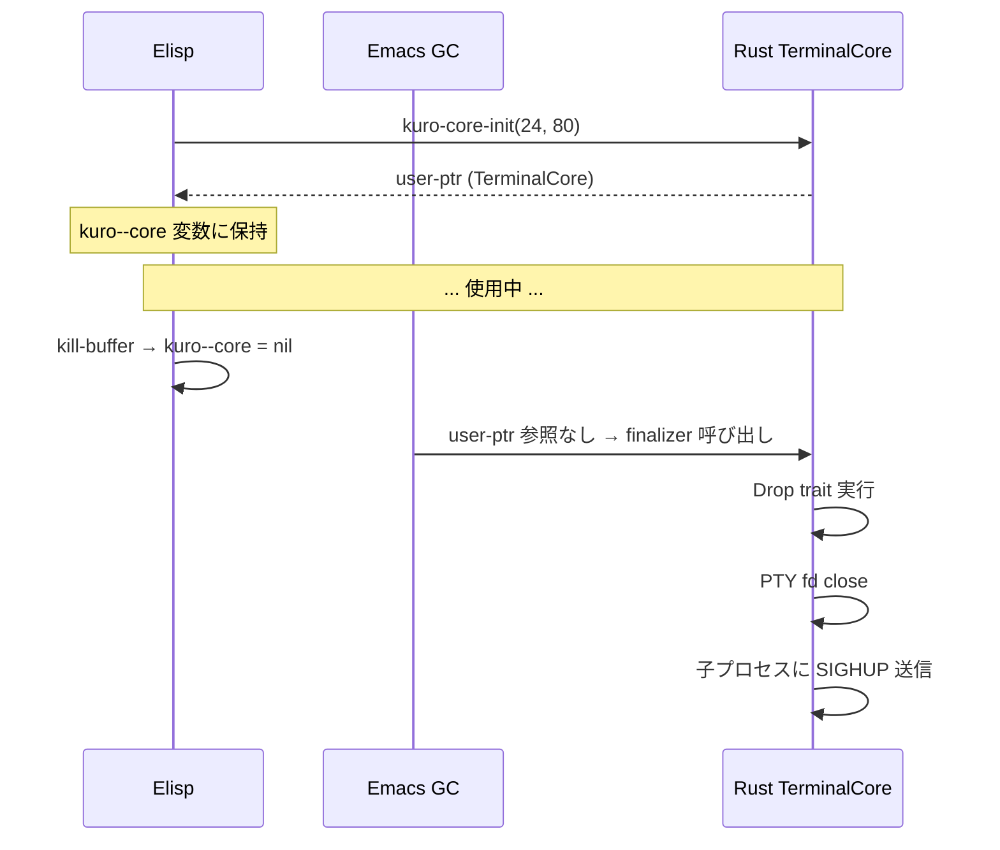

# モジュールブリッジ仕様

## 概要

モジュールブリッジは、Rust で実装されたダイナミックモジュール (`kuro-core`) のロードと、Elisp からの関数呼び出しラッパーを提供するレイヤーである。

Rust 側は [emacs-module-rs](https://github.com/ubolonton/emacs-module-rs) クレートを使用し、`#[defun]` アトリビュートで Elisp 関数を直接エクスポートする。Elisp 側はこれらの関数を薄いラッパーで包み、エラーハンドリングとライフサイクル管理を担当する。

```mermaid
graph LR
    EL[Elisp コード] -->|関数呼び出し| BR[モジュールブリッジ]
    BR -->|FFI| RS[Rust #[defun]]
    RS -->|user-ptr| EL
    RS -->|emacs-module-rs| EM[Emacs Module API]
```

## モジュールロード

### プラットフォーム別ライブラリ検索

Rust の共有ライブラリは OS に応じて拡張子が異なる。

```elisp
(require 'kuro-module)  ;; Rust .so/.dylib をロード

(defvar kuro-module-directory
  (file-name-directory (or load-file-name buffer-file-name))
  "kuro モジュールが格納されているディレクトリ。")

(defun kuro-module--locate ()
  "Rustモジュールの共有ライブラリを検索する。"
  (let ((module-name (pcase system-type
                       ('darwin "libkuro_core.dylib")
                       ('gnu/linux "libkuro_core.so")
                       (_ (error "Unsupported platform: %s" system-type)))))
    (expand-file-name module-name kuro-module-directory)))
```

| プラットフォーム | ファイル名 | `system-type` |
|---|---|---|
| macOS | `libkuro_core.dylib` | `darwin` |
| Linux | `libkuro_core.so` | `gnu/linux` |

### ロード手順

```elisp
(defun kuro-module--load ()
  "Rust ダイナミックモジュールをロードする。"
  (let ((module-path (kuro-module--locate)))
    (unless (file-exists-p module-path)
      (error "kuro: Module not found: %s" module-path))
    (module-load module-path)))
```

```mermaid
flowchart TD
    A[kuro-module--load] --> B[kuro-module--locate]
    B --> C{ファイル存在?}
    C -->|いいえ| D[error: Module not found]
    C -->|はい| E[module-load]
    E --> F[Rust #[module] init 実行]
    F --> G[#[defun] 関数が Elisp に登録]
```

## 関数ラッパー一覧

Rust 側で `#[defun]` マクロにより Elisp 関数としてエクスポートされる関数の一覧。

### コア操作

| Elisp 関数 | Rust `#[defun]` | 引数 | 戻り値 | 説明 |
|---|---|---|---|---|
| `kuro-core-init` | `kuro_core_init` | `(rows cols)` | `user-ptr` | TerminalCore を作成し PTY を起動 |
| `kuro-core-process-output` | `kuro_core_process_output` | `(core bytes)` | `nil` | PTY からのバイト列を VTE パーサーに処理させる |
| `kuro-core-poll-updates` | `kuro_core_poll_updates` | `(core)` | `vector \| nil` | dirty 行の更新データを取得 |
| `kuro-core-clear-dirty` | `kuro_core_clear_dirty` | `(core)` | `nil` | dirty フラグをすべてクリア |

### 入力・制御

| Elisp 関数 | Rust `#[defun]` | 引数 | 戻り値 | 説明 |
|---|---|---|---|---|
| `kuro-core-send-key` | `kuro_core_send_key` | `(core key)` | `nil` | キーイベントを PTY に送信 |
| `kuro-core-resize` | `kuro_core_resize` | `(core rows cols)` | `nil` | ターミナルサイズを変更し SIGWINCH を送信 |

### 状態取得

| Elisp 関数 | Rust `#[defun]` | 引数 | 戻り値 | 説明 |
|---|---|---|---|---|
| `kuro-core-get-cursor` | `kuro_core_get_cursor` | `(core)` | `(row . col)` | 現在のカーソル位置を cons セルで返す |
| `kuro-core-get-image` | `kuro_core_get_image` | `(core id)` | `string (unibyte)` | Kitty 画像の PNG バイナリデータを返す |

### 関数シグネチャ詳細

#### kuro-core-init

```elisp
(kuro-core-init rows cols)
```

- `rows` (integer): ターミナルの行数
- `cols` (integer): ターミナルの桁数
- 戻り値: `user-ptr` — Rust `TerminalCore` へのポインタ。Emacs GC により管理される。

```elisp
;; 使用例
(setq kuro--core (kuro-core-init 24 80))
```

#### kuro-core-poll-updates

```elisp
(kuro-core-poll-updates core)
```

- `core` (user-ptr): `kuro-core-init` で取得した TerminalCore
- 戻り値: 更新がある場合はベクタの配列、ない場合は `nil`

```
戻り値の構造:
  [[line_num content faces] ...]

  line_num: integer (0-indexed)
  content:  string (行の全テキスト)
  faces:    [[start end fg bg attrs] ...]
```

#### kuro-core-send-key

```elisp
(kuro-core-send-key core key)
```

- `core` (user-ptr): TerminalCore
- `key` (string): 送信する生バイト列 (例: `"\r"` = Enter, `"\x1b[A"` = Up)。Emacs のキー名ではなく、PTY に直接書き込むバイト列を指定する。

```elisp
;; 通常文字
(kuro-core-send-key core "a")

;; 特殊キー (エスケープシーケンス)
(kuro-core-send-key core "\e[A")   ; Up
(kuro-core-send-key core "\e[B")   ; Down
(kuro-core-send-key core "\r")     ; Enter
(kuro-core-send-key core "\t")     ; Tab
```

## エラーハンドリング

### エラー変換の仕組み

Rust 側で発生したエラーは `emacs-module-rs` によって Emacs のシグナルに変換される。



### エラーシグナル定義

```elisp
(define-error 'kuro-core-error "Rust モジュールから発生したエラー")
```

### エラー処理パターン

```elisp
(condition-case err
    (kuro-core-process-output core bytes)
  (kuro-core-error
   (message "kuro: Rust module error: %s" (error-message-string err))))
```

### エラーの種類

| Rust 側 | Elisp 側シグナル | 発生条件 |
|---|---|---|
| `panic!` | `kuro-core-error` | バグ、想定外の状態 |
| `Result::Err(PtyError)` | `kuro-core-error` | PTY の読み書き失敗 |
| `Result::Err(ParseError)` | `kuro-core-error` | 不正なエスケープシーケンス (通常は無視) |
| 無効な `user-ptr` | `wrong-type-argument` | 型の不一致 |

## ライフサイクル管理

### user-ptr と GC

`kuro-core-init` が返す `user-ptr` は Emacs の GC によって自動管理される。



### Drop trait による後処理

Rust の `TerminalCore` は `Drop` trait を実装し、以下のクリーンアップを行う。

| 処理順序 | 内容 |
|---|---|
| 1 | PTY マスター fd をクローズ |
| 2 | 子プロセス (シェル) に SIGHUP を送信 |
| 3 | GraphicsStore のメモリ解放 |
| 4 | VTE パーサーの状態破棄 |

### 明示的なクリーンアップ

GC に頼らず即時にリソースを解放したい場合のパターン:

```elisp
(defun kuro--cleanup ()
  "TerminalCore を明示的に破棄する。
user-ptr を nil にすることで次回 GC でリソースが解放される。"
  (when kuro--render-timer
    (cancel-timer kuro--render-timer)
    (setq kuro--render-timer nil))
  (setq kuro--core nil)
  (garbage-collect))
```

## データ型マッピング

Rust と Elisp 間のデータ型変換は `emacs-module-rs` が自動的に処理する。

| Rust 型 | Elisp 型 | 備考 |
|---|---|---|
| `i64` | `integer` | |
| `f64` | `float` | |
| `String` | `string` (multibyte) | UTF-8 |
| `Vec<u8>` | `string` (unibyte) | バイナリデータ |
| `bool` | `t` / `nil` | |
| `Option<T>` | `T` / `nil` | |
| `Vec<T>` | `vector` | |
| `(A, B)` | cons cell `(A . B)` | `kuro-core-get-cursor` の戻り値 |
| `Box<TerminalCore>` | `user-ptr` | GC 管理 |
