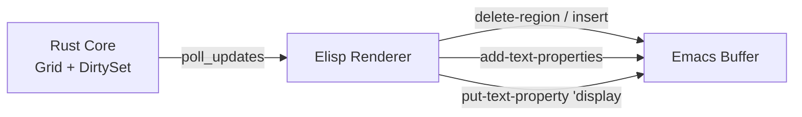
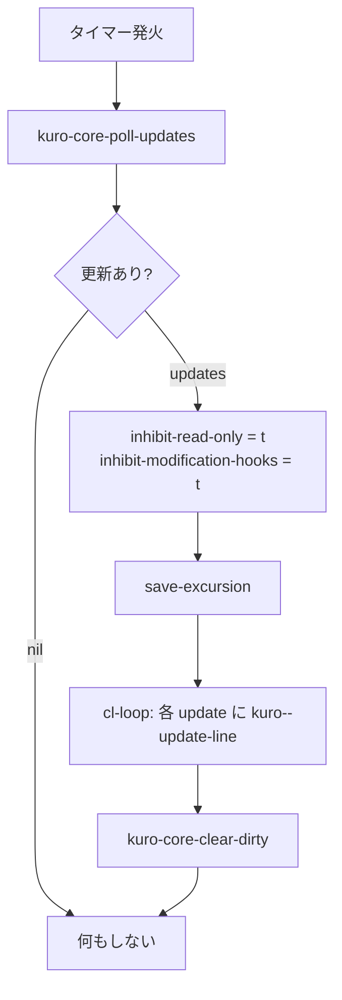

# Elisp レンダラー仕様

## 概要

Elisp レンダラーは、Rust モジュール (`TerminalCore`) から受け取った差分データに基づき、Emacs バッファを**最小限の操作で更新する描画エンジン**である。

設計方針として Elisp 側は「薄いクライアント」に徹し、グリッド管理・VTE パース・ダーティ行追跡などの重い処理はすべて Rust 側で行う。Elisp は Rust から受け取った差分リストをバッファへ反映するだけの責務を持つ。



## 描画ループ

レンダラーは `run-with-timer` によるポーリングループで駆動される。デフォルトの描画レートは **30fps** (約 33ms 間隔) である。

```elisp
(defvar kuro--render-timer nil
  "描画ループのタイマーオブジェクト。")

(defvar kuro--core nil
  "Rust TerminalCore の user-ptr。
emacs-module-rs により GC 管理される。")

(defun kuro--start-render-loop ()
  "描画ループを開始する。"
  (setq kuro--render-timer
        (run-with-timer 0 (/ 1.0 30)  ; 30fps
                        #'kuro--render-cycle)))

(defun kuro--stop-render-loop ()
  "描画ループを停止する。"
  (when kuro--render-timer
    (cancel-timer kuro--render-timer)
    (setq kuro--render-timer nil)))
```

### 描画サイクル

1フレーム分の描画サイクルは以下の手順で実行される。

```elisp
(defun kuro--render-cycle ()
  "1フレーム分の描画サイクル。"
  (when-let ((updates (kuro-core-poll-updates kuro--core)))
    (let ((inhibit-read-only t)
          (inhibit-modification-hooks t))
      (save-excursion
        (cl-loop for update across updates do
                 (kuro--update-line update)))
      (kuro-core-clear-dirty kuro--core))))
```



### ライフサイクル

| イベント | 処理 |
|---|---|
| `kuro-mode` 有効化 | `kuro--start-render-loop` で描画開始 |
| `kill-buffer-hook` | `kuro--stop-render-loop` で描画停止 |
| ウィンドウ非表示 | 描画サイクルは継続 (全 dirty 行を処理) |
| ウィンドウ再表示 | 次回サイクルで全 dirty 行を描画 |

## 行更新アルゴリズム

Rust から返される各 update は `[line_num content faces]` の 3 要素ベクタである。

```elisp
(defun kuro--update-line (update)
  "1行分の更新を適用する。
UPDATE は [line_num content faces] のベクタ。"
  (let ((line-num (aref update 0))
        (content  (aref update 1))
        (faces    (aref update 2)))
    (goto-char (point-min))
    (forward-line line-num)
    (let ((bol (line-beginning-position))
          (eol (line-end-position)))
      (delete-region bol eol)
      (insert content)
      ;; Face適用
      (kuro--apply-faces (line-beginning-position) faces))))
```

### 更新データ構造

```
update: [line_num: int, content: string, faces: vector]

faces の各要素:
  [start: int, end: int, fg: value, bg: value, attrs: int]

fg / bg の型:
  - nil       → デフォルト色
  - string    → "#RRGGBB" 形式 (Rust 側で Named/Indexed/TrueColor すべてを変換済み)
```

## Face マッピング

ターミナルの色属性を Emacs の Face に変換する。Rust 側が Named (ANSI 16色)、Indexed (256色)、TrueColor のすべてを `"#RRGGBB"` 文字列に変換してから Elisp に渡すため、Elisp 側ではカラーテーブルの管理は不要である。

fg / bg は `nil` (デフォルト色) または `"#RRGGBB"` 文字列のいずれかとなる。

### 属性フラグ

`attrs` はビットフラグとして渡される。

| ビット | 属性 | Face プロパティ |
|---|---|---|
| 0x01 | Bold | `:weight 'bold` |
| 0x02 | Italic | `:slant 'italic` |
| 0x04 | Underline | `:underline t` |
| 0x08 | Strikethrough | `:strike-through t` |
| 0x10 | Inverse | fg と bg を入れ替え |
| 0x20 | Dim | `:weight 'semi-light` |

### Face 適用

```elisp
(defun kuro--apply-faces (base-pos face-ranges)
  "FACE-RANGES: [[start end fg bg attrs] ...] をバッファに適用する。
BASE-POS は行頭の位置。"
  (cl-loop for range across face-ranges do
           (let* ((start (+ base-pos (aref range 0)))
                  (end   (+ base-pos (aref range 1)))
                  (fg    (aref range 2))
                  (bg    (aref range 3))
                  (attrs (aref range 4))
                  (face  (kuro--make-face fg bg attrs)))
             (add-text-properties start end (list 'face face)))))

(defun kuro--make-face (fg bg attrs)
  "色と属性から Face plist を構築する。
FG, BG は nil または \"#RRGGBB\" 文字列。
ATTRS はビットフラグ (integer)。"
  (let ((face nil)
        (actual-fg fg)
        (actual-bg bg))
    ;; Inverse (0x10): fg と bg を入れ替え
    (when (/= 0 (logand attrs #x10))
      (setq actual-fg bg
            actual-bg fg))
    (when actual-fg (push actual-fg face) (push :foreground face))
    (when actual-bg (push actual-bg face) (push :background face))
    (when (/= 0 (logand attrs #x01)) (push 'bold face) (push :weight face))
    (when (/= 0 (logand attrs #x02)) (push 'italic face) (push :slant face))
    (when (/= 0 (logand attrs #x04)) (push t face) (push :underline face))
    (when (/= 0 (logand attrs #x08)) (push t face) (push :strike-through face))
    (when (/= 0 (logand attrs #x20)) (push 'semi-light face) (push :weight face))
    (nreverse face)))
```

## 画像表示

Kitty Graphics Protocol で送信された画像を Emacs バッファ内に表示する。

```elisp
(defun kuro--handle-image (image-id row col)
  "Kitty画像をバッファ内に表示する。
IMAGE-ID: Rust GraphicsStore 内のID
ROW, COL: 表示位置 (グリッド座標)。"
  (let* ((data (kuro-core-get-image kuro--core image-id))
         (image (create-image data 'png t)))
    (save-excursion
      (goto-char (point-min))
      (forward-line row)
      (forward-char col)
      (put-text-property (point) (1+ (point))
                         'display image))))
```

### 画像表示の制約

| 制約 | 説明 |
|---|---|
| フォーマット | RGB, RGBA, PNG をサポート (Kitty Protocol の仕様に従う) |
| サイズ | セル単位で指定、ピクセルサイズは `frame-char-width` / `frame-char-height` で計算 |
| 重複 | 同一セルに新しい画像が来た場合は上書き |
| スクロール | 画像を含む行がスクロールアウトした場合、`display` プロパティは自然に不可視になる |

## 最適化

### フック抑制

描画サイクル中は以下の変数を束縛し、不要な処理を抑制する。

```elisp
(let ((inhibit-read-only t)              ; read-only チェック無効化
      (inhibit-modification-hooks t))     ; 変更フック (font-lock 等) 無効化
  ;; 描画処理
  )
```

これにより `font-lock-mode`、`after-change-functions`、`before-change-functions` 等の介入を防ぎ、描画パフォーマンスを確保する。

### Lazy Rendering (将来の最適化)

現在の実装ではすべての dirty 行を描画サイクルごとに処理する。可視領域のみを描画する Lazy Rendering は将来の最適化として検討されるが、正しく実装するには Rust 側で**描画済みの行のみ dirty フラグをクリアする**選択的クリア機能が必要となる。現行の `kuro-core-clear-dirty` はすべての dirty フラグを一括クリアするため、可視領域外の行をスキップすると、それらの行がスクロールで表示された際に再描画されないバグを引き起こす。

### Overlay vs Text Properties

| 方式 | 用途 | 理由 |
|---|---|---|
| Text Properties | 通常のテキスト色・属性 | 大量のセルに対して Overlay より高速 |
| Overlay | カーソル表示 | 頻繁に移動する要素に適している |
| `display` プロパティ | 画像表示 | Emacs の画像表示機構を利用 |

### パフォーマンス目標

| 指標 | 目標値 | 説明 |
|---|---|---|
| 描画レート | 30fps (設定で 60fps まで可) | `run-with-timer` の間隔で制御 |
| 1フレームあたりの処理時間 | < 16ms | 60fps を維持するための上限 |
| バッファ書き込み回数 | dirty 行数に比例 | 変更のない行は触らない |
| GC 圧力 | 最小限 | 一時オブジェクトの生成を抑制 |
