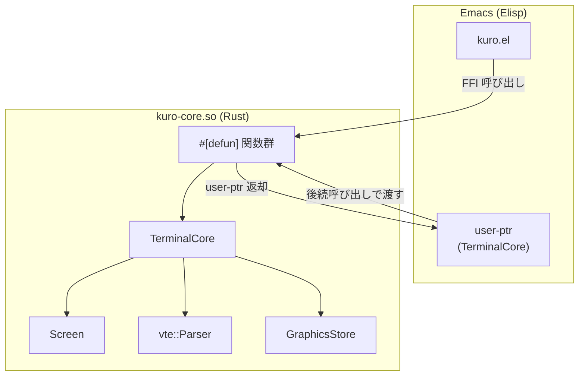
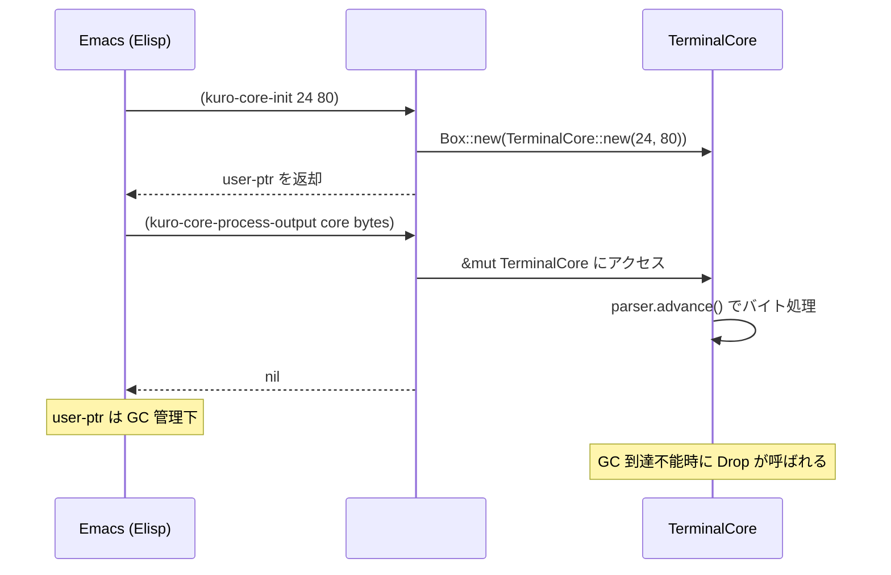
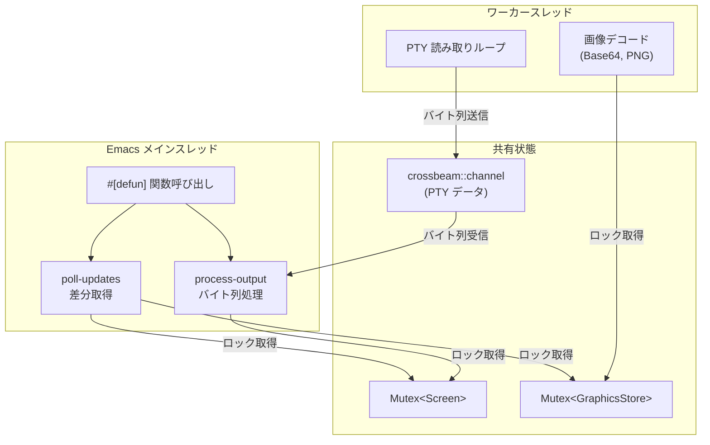

# Emacs FFI インターフェース仕様

## 概要

kuro は [emacs-module-rs](https://crates.io/crates/emacs) (emacs crate v0.19.0) を使用して、Rust で実装されたターミナルコアを Emacs の動的モジュールとして公開する。`#[defun]` マクロにより Rust 関数を Elisp 関数としてエクスポートし、`user-ptr` 型を介して Rust のオブジェクトを Emacs 側で透過的に保持する。



## モジュール初期化

```rust
use emacs::{defun, Env, Result, Value};

emacs::plugin_is_GPL_compatible!();

#[emacs::module(name = "kuro-core")]
fn init(env: &Env) -> Result<()> {
    Ok(())
}
```

| 要素 | 説明 |
|---|---|
| `plugin_is_GPL_compatible!()` | Emacs が要求する GPL 互換性宣言マクロ。これがないとモジュールのロードが拒否される。 |
| `#[emacs::module(name = "kuro-core")]` | モジュール名を `kuro-core` として登録する。Elisp 側では `(require 'kuro-core)` でロードする。 |
| `init` 関数 | モジュールロード時に1回だけ呼ばれる初期化関数。`Env` はEmacs 環境へのハンドル。 |

## user-ptr パターン

Rust の構造体を Emacs の `user-ptr` 型として管理するパターン。`emacs::Transfer` トレイトの実装により、ガベージコレクション連携と型安全なアクセスを実現する。

```rust
struct TerminalCore {
    screen: Screen,
    alt_screen: Option<Screen>,
    parser: vte::Parser,
    graphics: GraphicsStore,
    current_attr: CellAttr,
    saved_cursor: Option<Cursor>,
    title: String,
    bell_pending: bool,
}

impl emacs::Transfer for TerminalCore {
    fn type_name() -> &'static str { "TerminalCore" }
}
```

| フィールド | 型 | 説明 |
|---|---|---|
| `screen` | `Screen` | 現在アクティブな仮想スクリーン（Primary または Alternate）。 |
| `alt_screen` | `Option<Screen>` | Alternate Screen Buffer。`None` の場合は Primary がアクティブ。 |
| `parser` | `vte::Parser` | VTE パーサーインスタンス。状態を保持する。 |
| `graphics` | `GraphicsStore` | Kitty Graphics 画像データストア。 |
| `current_attr` | `CellAttr` | SGR で設定された現在の文字属性。新規 Cell 生成時に適用される。 |
| `saved_cursor` | `Option<Cursor>` | DECSC で保存されたカーソル位置。 |
| `title` | `String` | OSC で設定されたウィンドウタイトル。 |
| `bell_pending` | `bool` | BEL 受信フラグ。`poll_updates` で Emacs 側に通知後にクリアされる。 |

### user-ptr のライフサイクル



1. `kuro-core-init` で `Box<TerminalCore>` を生成し、Emacs に `user-ptr` として返却。
2. 以降の関数呼び出しでは `user-ptr` を第1引数として受け取り、内部の `TerminalCore` に `&mut` アクセスする。
3. Emacs の GC が `user-ptr` を回収する際に Rust 側の `Drop` が呼ばれ、メモリが解放される。

## エクスポート関数一覧

| Elisp 関数名 | Rust 関数名 | 引数 | 戻り値 | 説明 |
|---|---|---|---|---|
| `kuro-core-init` | `kuro_core_init` | `(rows, cols)` | `user-ptr` | TerminalCore を指定サイズで初期化して返す。 |
| `kuro-core-process-output` | `kuro_core_process_output` | `core`, `bytes` | `nil` | PTY 出力バイト列をパーサーに投入する。 |
| `kuro-core-poll-updates` | `kuro_core_poll_updates` | `core` | `vector \| nil` | dirty lines と画像更新情報を取得する。更新がない場合は `nil`。 |
| `kuro-core-clear-dirty` | `kuro_core_clear_dirty` | `core` | `nil` | dirty フラグをクリアする。 |
| `kuro-core-send-key` | `kuro_core_send_key` | `core`, `key` | `nil` | キー入力を PTY へ送信するバイト列に変換する。 |
| `kuro-core-resize` | `kuro_core_resize` | `core`, `rows`, `cols` | `nil` | 画面サイズを変更する。 |
| `kuro-core-get-cursor` | `kuro_core_get_cursor` | `core` | `(row . col)` | カーソル位置を取得する。 |
| `kuro-core-get-image` | `kuro_core_get_image` | `core`, `id` | `image-data` | 指定 ID の画像データを取得する。 |

## 各関数の詳細

### `kuro-core-init`

```rust
#[defun(user_ptr)]
fn kuro_core_init(env: &Env, rows: i64, cols: i64) -> Result<Box<TerminalCore>> {
    Ok(Box::new(TerminalCore::new(rows as usize, cols as usize)))
}
```

TerminalCore を指定された行数・列数で初期化する。戻り値は `user-ptr` 型の Emacs Value。

**Elisp 使用例:**

```elisp
(setq kuro--core (kuro-core-init 24 80))
```

### `kuro-core-process-output`

```rust
#[defun]
fn kuro_core_process_output(
    env: &Env,
    core: &mut TerminalCore,
    bytes: Vec<u8>,
) -> Result<()> {
    core.parser.advance(&mut core.handler, &bytes);
    Ok(())
}
```

PTY から読み取ったバイト列を VTE パーサーに投入する。パース結果は `Perform` トレイトのコールバックを通じて Screen に反映される。

| 引数 | Elisp 型 | Rust 型 | 説明 |
|---|---|---|---|
| `core` | `user-ptr` | `&mut TerminalCore` | ターミナルコアへの可変参照。 |
| `bytes` | `string` (unibyte) | `Vec<u8>` | PTY 出力のバイト列。Emacs の unibyte 文字列として渡す。`FromLisp` で自動変換される。 |

### `kuro-core-poll-updates`

```rust
#[defun]
fn kuro_core_poll_updates(
    env: &Env,
    core: &mut TerminalCore,
) -> Result<Value<'_>> {
    let dirty_lines = core.screen.get_dirty_lines();

    if dirty_lines.is_empty() {
        return env.intern("nil");
    }

    let result = env.make_vector(dirty_lines.len(), env.intern("nil")?)?;

    for (i, (line_num, line)) in dirty_lines.iter().enumerate() {
        let line_data = encode_line(env, *line_num, line)?;
        result.set(i, line_data)?;
    }

    result.into_lisp(env)
}
```

変更のあった行の情報をベクタとして返す。Emacs 側はこのデータをもとにバッファの差分更新を行う。

| 引数 | Elisp 型 | Rust 型 | 説明 |
|---|---|---|---|
| `core` | `user-ptr` | `&mut TerminalCore` | ターミナルコアへの可変参照。 |

**戻り値の構造:**

```
#([line_data_0, line_data_1, ...])
```

各 `line_data` の詳細は後述の「データ転送方式」を参照。

### `kuro-core-clear-dirty`

```rust
#[defun]
fn kuro_core_clear_dirty(
    env: &Env,
    core: &mut TerminalCore,
) -> Result<()> {
    core.screen.clear_dirty();
    Ok(())
}
```

全行の dirty フラグと `dirty_set` をクリアする。`poll_updates` で差分データを取得した後に呼び出す。

### `kuro-core-send-key`

```rust
#[defun]
fn kuro_core_send_key(
    env: &Env,
    core: &mut TerminalCore,
    key: Vec<u8>,
) -> Result<()> {
    core.pty.write_all(&key)?;
    Ok(())
}
```

Elisp 側で変換済みのバイトシーケンスを受け取り、PTY に直接書き込む。

| 引数 | Elisp 型 | Rust 型 | 説明 |
|---|---|---|---|
| `core` | `user-ptr` | `&mut TerminalCore` | ターミナルコアへの可変参照。 |
| `key` | `string` (unibyte) | `Vec<u8>` | バイトシーケンス（例: `"\r"`, `"\x1b[A"` 等）。Elisp 側でキーからバイト列に変換済み。 |

**バイトシーケンス例:**

| バイトシーケンス | 送信バイト列 | 説明 |
|---|---|---|
| `"\r"` | `\r` (0x0D) | Enter キー。 |
| `"\t"` | `\t` (0x09) | Tab キー。 |
| `"\x7f"` | `\x7f` | Backspace キー。 |
| `"\x03"` | `\x03` | Ctrl+C。 |
| `"\x04"` | `\x04` | Ctrl+D。 |
| `"\x1b[A"` or `"\x1bOA"` | `\e[A` or `\eOA` | 上矢印（DECCKM モードにより異なる）。 |
| `"\x1b[B"` or `"\x1bOB"` | `\e[B` or `\eOB` | 下矢印。 |
| `"\x1b[C"` or `"\x1bOC"` | `\e[C` or `\eOC` | 右矢印。 |
| `"\x1b[D"` or `"\x1bOD"` | `\e[D` or `\eOD` | 左矢印。 |

### `kuro-core-resize`

```rust
#[defun]
fn kuro_core_resize(
    env: &Env,
    core: &mut TerminalCore,
    rows: usize,
    cols: usize,
) -> Result<()> {
    core.screen.resize(rows, cols);
    Ok(())
}
```

画面サイズを変更する。Emacs のウィンドウサイズ変更時に呼び出す。

| 引数 | Elisp 型 | Rust 型 | 説明 |
|---|---|---|---|
| `core` | `user-ptr` | `&mut TerminalCore` | ターミナルコアへの可変参照。 |
| `rows` | `integer` | `usize` | 新しい行数。 |
| `cols` | `integer` | `usize` | 新しい列数。 |

### `kuro-core-get-cursor`

```rust
#[defun]
fn kuro_core_get_cursor(
    env: &Env,
    core: &TerminalCore,
) -> Result<Value<'_>> {
    let row = core.screen.cursor.y.into_lisp(env)?;
    let col = core.screen.cursor.x.into_lisp(env)?;
    env.cons(row, col)
}
```

カーソル位置をコンスセルとして返す。

| 戻り値 | Elisp 型 | 説明 |
|---|---|---|
| — | `(row . col)` | 行と列の0始まりの座標。 |

### `kuro-core-get-image`

```rust
#[defun]
fn kuro_core_get_image(
    env: &Env,
    core: &mut TerminalCore,
    id: u32,
) -> Result<Value<'_>> {
    match core.graphics.get_image(id) {
        Some(image) => {
            // PNG エンコードされたバイト列を unibyte 文字列として返す
            let png_data = image.encode_to_png()?;
            png_data.into_lisp(env)
        }
        None => env.intern("nil"),
    }
}
```

指定 ID の画像データを PNG エンコードされた unibyte 文字列として返す。Emacs 側では `create-image` でインライン画像を生成する。

| 引数 | Elisp 型 | Rust 型 | 説明 |
|---|---|---|---|
| `core` | `user-ptr` | `&mut TerminalCore` | ターミナルコアへの可変参照。 |
| `id` | `integer` | `u32` | 画像 ID。 |

## データ転送方式

### poll_updates の戻り値フォーマット

`kuro-core-poll-updates` は Emacs の vector of vectors を返す。

```
#(                              ;; 外側ベクタ: dirty lines の配列
  #(line_number                 ;; 行番号 (0始まり)
    content_string              ;; 行内容の文字列
    #(                          ;; face_ranges ベクタ
      #(start end fg bg attrs)  ;; 各属性範囲
      #(start end fg bg attrs)
      ...
    )
  )
  ...
)
```

#### 各行データの構造

| インデックス | 名称 | Elisp 型 | 説明 |
|---|---|---|---|
| 0 | `line_number` | `integer` | 行番号（0始まり）。 |
| 1 | `content_string` | `string` | 行内の全文字を連結した文字列。 |
| 2 | `face_ranges` | `vector` | 文字属性の範囲指定ベクタ。 |

#### face_ranges の各要素

| インデックス | 名称 | Elisp 型 | 説明 |
|---|---|---|---|
| 0 | `start` | `integer` | 属性範囲の開始列（0始まり、含む）。 |
| 1 | `end` | `integer` | 属性範囲の終了列（0始まり、含まない）。 |
| 2 | `fg` | `string` or `nil` | 前景色。`"#RRGGBB"` 形式または `nil`（デフォルト色）。 |
| 3 | `bg` | `string` or `nil` | 背景色。`"#RRGGBB"` 形式または `nil`（デフォルト色）。 |
| 4 | `attrs` | `integer` | 属性ビットフラグ。 |

#### attrs ビットフラグ

| ビット | 値 | 属性 |
|---|---|---|
| 0 | `0x01` | bold |
| 1 | `0x02` | italic |
| 2 | `0x04` | underline |
| 3 | `0x08` | strikethrough |
| 4 | `0x10` | inverse (反転) |
| 5 | `0x20` | dim (暗い) |

**Color エンコード例:**

```rust
fn color_to_elisp(env: &Env, color: &Color) -> Result<Value<'_>> {
    match color {
        Color::Default => env.intern("nil"),
        Color::Named(named) => {
            let rgb = named.to_rgb();
            format!("#{:02x}{:02x}{:02x}", rgb.0, rgb.1, rgb.2)
                .into_lisp(env)
        }
        Color::Indexed(idx) => {
            let rgb = palette_256(*idx);
            format!("#{:02x}{:02x}{:02x}", rgb.0, rgb.1, rgb.2)
                .into_lisp(env)
        }
        Color::Rgb(r, g, b) => {
            format!("#{:02x}{:02x}{:02x}", r, g, b)
                .into_lisp(env)
        }
    }
}
```

## スレッドモデル

Emacs の動的モジュール API はスレッドセーフではない。`Env` は `Send` を実装しておらず、Emacs API の呼び出しはモジュールをロードしたスレッド（Emacs のメインスレッド）に限定される。



### スレッド間同期方式

| 同期対象 | 同期プリミティブ | 説明 |
|---|---|---|
| PTY データ転送 | `crossbeam::channel` | ワーカースレッドが PTY から読み取ったバイト列をチャネル経由でメインスレッドに送信する。 |
| Screen アクセス | `Mutex<Screen>` | メインスレッドの `process-output` と `poll-updates` が排他的にアクセスする。 |
| GraphicsStore アクセス | `Mutex<GraphicsStore>` | 画像デコードスレッドと `poll-updates` が排他的にアクセスする。 |

### PTY 読み取りループ

```rust
use crossbeam_channel::{bounded, Receiver, Sender};
use std::io::Read;
use std::thread;

fn start_pty_reader(pty_fd: std::fs::File) -> Receiver<Vec<u8>> {
    let (tx, rx): (Sender<Vec<u8>>, Receiver<Vec<u8>>) = bounded(64);

    thread::spawn(move || {
        let mut buf = [0u8; 4096];
        let mut pty = pty_fd;
        loop {
            match pty.read(&mut buf) {
                Ok(0) => break,  // EOF
                Ok(n) => {
                    if tx.send(buf[..n].to_vec()).is_err() {
                        break;  // 受信側が切断
                    }
                }
                Err(_) => break,
            }
        }
    });

    rx
}
```

### Emacs タイマーとの連携

Emacs 側ではタイマーを使用して定期的に `poll_updates` を呼び出す。

```elisp
(defun kuro--poll ()
  "ターミナル出力をポーリングして画面を更新する。"
  ;; チャネルからバイト列を取得してパーサーに投入
  (kuro-core-process-output kuro--core (kuro--read-pty))
  ;; dirty lines を取得して Emacs バッファに反映
  (let ((updates (kuro-core-poll-updates kuro--core)))
    (kuro--apply-updates updates))
  ;; dirty フラグをクリア
  (kuro-core-clear-dirty kuro--core))

;; 約33ms 間隔でポーリング（約30fps）
(run-at-time 0 (/ 1.0 30) #'kuro--poll)
```

## IntoLisp / FromLisp トレイト

emacs crate v0.19.0 が提供する型変換トレイト。Rust 型と Emacs Value の相互変換を行う。

| Rust 型 | Elisp 型 | 変換方向 | 備考 |
|---|---|---|---|
| `i64` | `integer` | 双方向 | `IntoLisp` + `FromLisp` |
| `f64` | `float` | 双方向 | `IntoLisp` + `FromLisp` |
| `String` | `string` | 双方向 | `IntoLisp` + `FromLisp` |
| `bool` | `t` / `nil` | 双方向 | `IntoLisp` + `FromLisp` |
| `Option<T>` | `T` / `nil` | 双方向 | `None` は `nil` に変換 |
| `Vec<u8>` | `string` (unibyte) | `FromLisp` | バイト列の受け取り |
| `Box<T: Transfer>` | `user-ptr` | `IntoLisp` | Rust オブジェクトの Emacs 管理 |
| `&T` / `&mut T` | `user-ptr` | `FromLisp` | user-ptr からの参照取得 |

### Vector 構造体

emacs crate の `Vector` 型は Emacs のベクタ（固定長配列）を操作する。

```rust
use emacs::Vector;

// ベクタの作成
let vec = env.make_vector(size, initial_value)?;

// 要素の設定
vec.set(index, value)?;

// 要素の取得
let val: Value = vec.get(index)?;

// サイズの取得
let len: usize = vec.size()?;
```

| メソッド | シグネチャ | 説明 |
|---|---|---|
| `Env::make_vector` | `fn make_vector(&self, size: usize, init: Value) -> Result<Vector>` | 指定サイズのベクタを生成し、全要素を `init` で初期化する。 |
| `Vector::set` | `fn set(&self, index: usize, value: Value) -> Result<()>` | 指定インデックスに値を設定する。 |
| `Vector::get` | `fn get(&self, index: usize) -> Result<Value>` | 指定インデックスの値を取得する。 |
| `Vector::size` | `fn size(&self) -> Result<usize>` | ベクタのサイズを返す。 |
