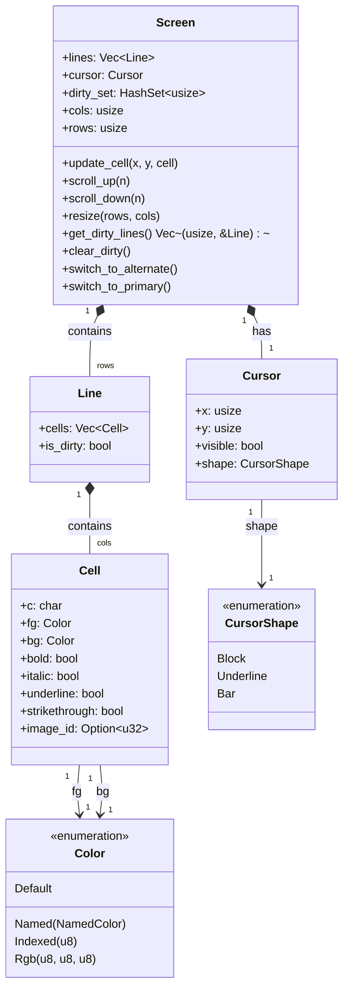
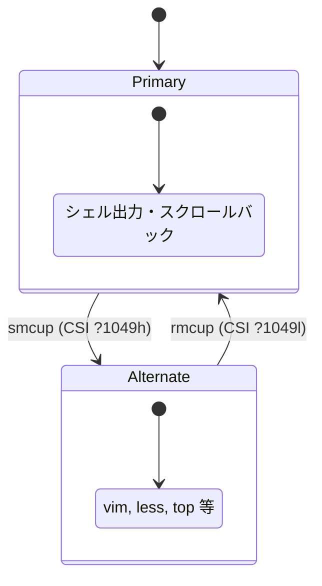

# 仮想スクリーン (Grid) 仕様

## 概要

kuro の仮想ターミナル画面は **Screen / Line / Cell** の3層データ構造で管理される。物理端末やGUIウィンドウを持たず、Rust 側のメモリ上にグリッドバッファを構築し、差分（dirty lines）のみを Emacs 側へ転送する設計である。



## Cell 構造体

ターミナル画面上の1文字分のデータを保持する最小単位。

```rust
struct Cell {
    c: char,
    fg: Color,
    bg: Color,
    bold: bool,
    italic: bool,
    underline: bool,
    strikethrough: bool,
    image_id: Option<u32>,  // Kitty Graphics 画像参照
}
```

| フィールド | 型 | 説明 |
|---|---|---|
| `c` | `char` | 表示文字。空セルは `' '`（スペース）。CJK幅広文字の場合、後続セルに幅ゼロのプレースホルダーを配置する。 |
| `fg` | `Color` | 前景色。 |
| `bg` | `Color` | 背景色。 |
| `bold` | `bool` | ボールド属性。SGR パラメータ `1` で有効化。 |
| `italic` | `bool` | イタリック属性。SGR パラメータ `3` で有効化。 |
| `underline` | `bool` | アンダーライン属性。SGR パラメータ `4` で有効化。 |
| `strikethrough` | `bool` | 取り消し線属性。SGR パラメータ `9` で有効化。 |
| `image_id` | `Option<u32>` | Kitty Graphics Protocol で配置された画像の ID。画像が存在しないセルは `None`。 |

### デフォルト値

```rust
impl Default for Cell {
    fn default() -> Self {
        Self {
            c: ' ',
            fg: Color::Default,
            bg: Color::Default,
            bold: false,
            italic: false,
            underline: false,
            strikethrough: false,
            image_id: None,
        }
    }
}
```

## Color 型

ターミナルの色表現を統一的に扱う列挙型。ANSI 16色、256色パレット、TrueColor (24bit RGB) の3方式を対応する。

```rust
enum Color {
    Named(NamedColor),    // ANSI 16色
    Indexed(u8),          // 256色
    Rgb(u8, u8, u8),      // TrueColor
    Default,              // ターミナルのデフォルト色
}
```

| バリアント | 値域 | 説明 |
|---|---|---|
| `Named(NamedColor)` | `Black`, `Red`, `Green`, `Yellow`, `Blue`, `Magenta`, `Cyan`, `White` + 各 Bright 版（計16色） | ANSI 標準16色。SGR 30-37, 40-47, 90-97, 100-107 で指定される。 |
| `Indexed(u8)` | `0..=255` | 256色パレット。SGR `38;5;n` / `48;5;n` で指定される。0-7 は Named の通常色、8-15 は Bright 色、16-231 は 6x6x6 カラーキューブ、232-255 はグレースケール。 |
| `Rgb(u8, u8, u8)` | 各チャネル `0..=255` | TrueColor。SGR `38;2;r;g;b` / `48;2;r;g;b` で指定される。 |
| `Default` | — | ターミナルの既定前景色/背景色。SGR `39` / `49` で指定される。 |

### NamedColor 列挙型

```rust
enum NamedColor {
    Black,
    Red,
    Green,
    Yellow,
    Blue,
    Magenta,
    Cyan,
    White,
    BrightBlack,
    BrightRed,
    BrightGreen,
    BrightYellow,
    BrightBlue,
    BrightMagenta,
    BrightCyan,
    BrightWhite,
}
```

## Line 構造体

1行分のセル列と変更フラグを保持する。

```rust
struct Line {
    cells: Vec<Cell>,
    is_dirty: bool,
}
```

| フィールド | 型 | 説明 |
|---|---|---|
| `cells` | `Vec<Cell>` | 行内の各セル。長さは常に `Screen::cols` と一致する。 |
| `is_dirty` | `bool` | この行が前回の `clear_dirty()` 以降に変更されたかを示すフラグ。`true` の場合、Emacs 側へ転送対象となる。 |

## Screen 構造体

仮想ターミナル画面全体を管理する構造体。行バッファ、カーソル状態、変更追跡を統合する。

```rust
struct Screen {
    lines: Vec<Line>,
    cursor: Cursor,
    dirty_set: HashSet<usize>,
    cols: usize,
    rows: usize,
}
```

| フィールド | 型 | 説明 |
|---|---|---|
| `lines` | `Vec<Line>` | 画面の全行。長さは `rows` と一致する。 |
| `cursor` | `Cursor` | 現在のカーソル状態。 |
| `dirty_set` | `HashSet<usize>` | 変更された行のインデックスを保持するセット。`Line::is_dirty` と同期している。 |
| `cols` | `usize` | 画面の列数。 |
| `rows` | `usize` | 画面の行数。 |

## Cursor 構造体

カーソルの位置、表示状態、形状を保持する。

```rust
struct Cursor {
    x: usize,
    y: usize,
    visible: bool,
    shape: CursorShape,
}
```

| フィールド | 型 | 説明 |
|---|---|---|
| `x` | `usize` | カーソルの列位置（0始まり）。 |
| `y` | `usize` | カーソルの行位置（0始まり）。 |
| `visible` | `bool` | カーソルの表示/非表示。DECTCEM (`?25h` / `?25l`) で制御される。 |
| `shape` | `CursorShape` | カーソル形状。`Block`、`Underline`、`Bar` のいずれか。DECSCUSR で変更される。 |

## Primary / Alternate Screen Buffer

ターミナルは2つの独立した Screen インスタンスを保持する。



| バッファ | 用途 | スクロールバック | 切替シーケンス |
|---|---|---|---|
| Primary | 通常のシェル操作。スクロールバック履歴を保持する。 | あり | `CSI ?1049l` (rmcup) |
| Alternate | フルスクリーンアプリケーション（vim, less, top など）。終了時に Primary に復帰する。 | なし | `CSI ?1049h` (smcup) |

バッファ切替時の動作:

1. **Primary → Alternate**: 現在の Primary Screen のカーソル位置を保存。新規の Alternate Screen を `rows x cols` で初期化。
2. **Alternate → Primary**: Alternate Screen を破棄。保存済みの Primary Screen とカーソル位置を復元。

## 公開メソッド一覧

### `update_cell(x: usize, y: usize, cell: Cell)`

指定座標のセルを更新し、当該行を dirty としてマークする。

| 引数 | 型 | 説明 |
|---|---|---|
| `x` | `usize` | 列位置（0始まり）。`cols` 以上の場合は無視される。 |
| `y` | `usize` | 行位置（0始まり）。`rows` 以上の場合は無視される。 |
| `cell` | `Cell` | 書き込むセルデータ。 |

```rust
fn update_cell(&mut self, x: usize, y: usize, cell: Cell) {
    if x < self.cols && y < self.rows {
        self.lines[y].cells[x] = cell;
        self.lines[y].is_dirty = true;
        self.dirty_set.insert(y);
    }
}
```

### `scroll_up(n: usize)`

画面を n 行上方向にスクロールする。最上行が消え、最下行に空行が追加される。スクロール領域（DECSTBM）が設定されている場合はその範囲内でスクロールする。

| 引数 | 型 | 説明 |
|---|---|---|
| `n` | `usize` | スクロールする行数。 |

### `scroll_down(n: usize)`

画面を n 行下方向にスクロールする。最下行が消え、最上行に空行が挿入される。

| 引数 | 型 | 説明 |
|---|---|---|
| `n` | `usize` | スクロールする行数。 |

### `resize(rows: usize, cols: usize)`

画面サイズを変更する。行数・列数の増減に応じてバッファを拡張または切り詰める。リサイズ後は全行を dirty としてマークする。

| 引数 | 型 | 説明 |
|---|---|---|
| `rows` | `usize` | 新しい行数。 |
| `cols` | `usize` | 新しい列数。 |

リサイズ時の動作:

1. **列数増加**: 各行の末尾にデフォルト Cell を追加。
2. **列数減少**: 各行の末尾を切り詰め。カーソルが範囲外の場合は `cols - 1` にクランプ。
3. **行数増加**: 画面下部にデフォルト Line を追加。
4. **行数減少**: 画面下部の行を削除。カーソルが範囲外の場合は `rows - 1` にクランプ。

### `get_dirty_lines() -> Vec<(usize, &Line)>`

変更のあった行のインデックスと参照のリストを返す。Emacs 側への差分転送に使用される。

| 戻り値 | 型 | 説明 |
|---|---|---|
| — | `Vec<(usize, &Line)>` | `(行インデックス, 行への参照)` のベクタ。行インデックスの昇順でソートされている。 |

### `clear_dirty()`

すべての行の dirty フラグと `dirty_set` をクリアする。Emacs 側への転送完了後に呼び出す。

### `switch_to_alternate()`

Alternate Screen Buffer に切り替える。現在の Primary Screen のカーソル位置を保存し、新しい Alternate Screen を初期化する。

### `switch_to_primary()`

Primary Screen Buffer に復帰する。Alternate Screen を破棄し、保存済みの Primary Screen とカーソル位置を復元する。

## 座標系

```
(0,0) ────────────────────► x (cols)
  │
  │   Cell[0][0]  Cell[1][0]  Cell[2][0] ...
  │   Cell[0][1]  Cell[1][1]  Cell[2][1] ...
  │   Cell[0][2]  Cell[1][2]  Cell[2][2] ...
  │   ...
  ▼
  y (rows)
```

- `x` は列（左から右）、`y` は行（上から下）を表す。
- 座標は0始まり。ただし ANSI エスケープシーケンスでは1始まりのため、パーサー層で変換を行う。
