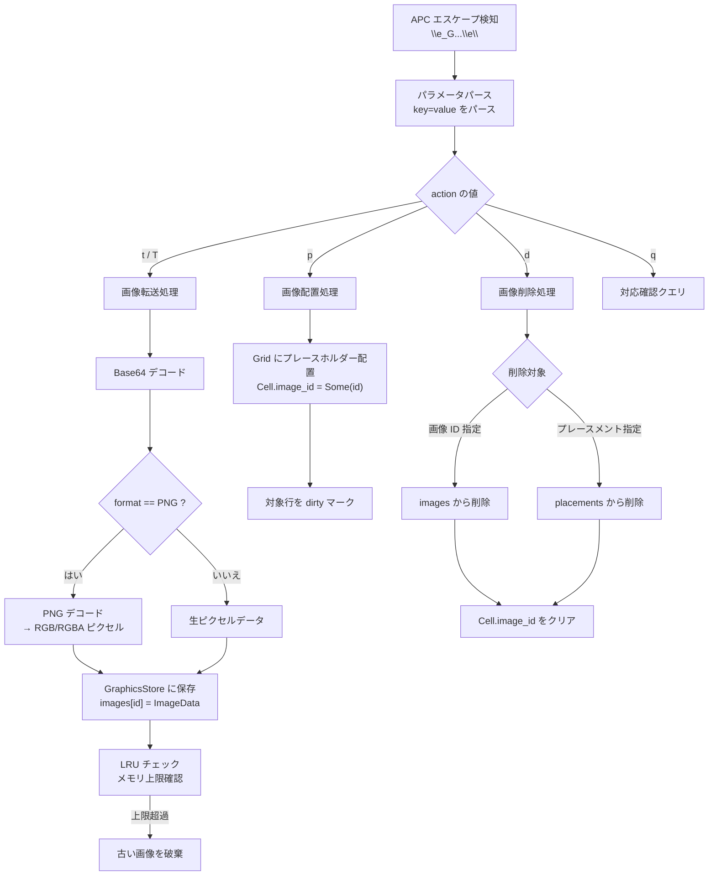
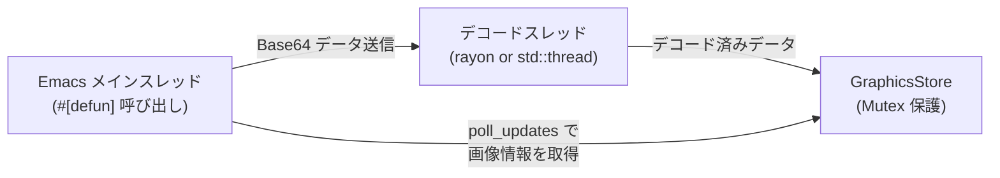

# Kitty Graphics Protocol 処理仕様

## プロトコル概要

Kitty Graphics Protocol は、ターミナル上にラスター画像を表示するための拡張エスケープシーケンスである。kuro は [vte-graphics](https://crates.io/crates/vte-graphics) v0.15.0（vte crate のフォーク、APC エスケープ対応）を使用してシーケンスをパースし、Rust 側で画像データを管理する。

### シーケンス形式

```
\e_G key=value,key=value;[Base64 payload]\e\
```

- `\e_G` : APC (Application Program Command) 開始 + `G` プレフィクス
- キー・値ペア : カンマ区切りのパラメータ
- `;` : パラメータと payload の区切り
- payload : Base64 エンコードされた画像データ（省略可能）
- `\e\` : ST (String Terminator)

### 主要キー一覧

| キー | 名称 | 値の型 | 説明 |
|---|---|---|---|
| `a` | action | `t`, `T`, `p`, `d`, `f`, `q` | 動作指定。 |
| `f` | format | `24`, `32`, `100` | 画像フォーマット。`24`=RGB、`32`=RGBA、`100`=PNG。 |
| `t` | transmission | `d`, `f`, `t`, `s` | 転送方式。`d`=ダイレクト（payload にデータ）。 |
| `s` | width | 整数 | 画像のピクセル幅。 |
| `v` | height | 整数 | 画像のピクセル高さ。 |
| `i` | id | 整数 (1-4294967295) | 画像 ID。省略時は自動採番。 |
| `p` | placement_id | 整数 | プレースメント ID。同一画像の複数配置を区別する。 |
| `m` | more | `0`, `1` | チャンク転送。`1`=後続チャンクあり、`0`=最終チャンク。 |
| `q` | quiet | `1`, `2` | 応答抑制。`1`=OK応答を抑制、`2`=全応答を抑制。 |
| `c` | columns | 整数 | 表示幅（セル単位）。 |
| `r` | rows | 整数 | 表示高さ（セル単位）。 |
| `X` | x_offset | 整数 | セル内 X オフセット（ピクセル）。 |
| `Y` | y_offset | 整数 | セル内 Y オフセット（ピクセル）。 |

### action 値の詳細

| 値 | 名称 | 説明 |
|---|---|---|
| `t` | transmit | 画像データを転送・保存する。表示は行わない。 |
| `T` | transmit and display | 画像データを転送し、即座に表示する。 |
| `p` | place | 既に保存済みの画像を指定位置に配置する。 |
| `d` | delete | 画像またはプレースメントを削除する。 |
| `f` | frame | アニメーションフレームの操作。 |
| `q` | query | 対応確認のクエリ。 |

## データ構造

### GraphicsStore

画像データの一元管理ストア。

```rust
struct GraphicsStore {
    images: HashMap<u32, ImageData>,
    placements: Vec<ImagePlacement>,
    next_id: u32,
    total_bytes: usize,
    max_bytes: usize,        // メモリ上限（デフォルト: 256MB）
    lru_order: VecDeque<u32>, // LRU 追跡用
}
```

| フィールド | 型 | 説明 |
|---|---|---|
| `images` | `HashMap<u32, ImageData>` | 画像 ID をキーとする画像データマップ。 |
| `placements` | `Vec<ImagePlacement>` | 画面上の画像配置情報のリスト。 |
| `next_id` | `u32` | 自動採番用の次の画像 ID。 |
| `total_bytes` | `usize` | 現在の総メモリ使用量（バイト）。 |
| `max_bytes` | `usize` | メモリ使用量の上限。超過時に LRU で古い画像を破棄する。 |
| `lru_order` | `VecDeque<u32>` | 最終アクセス順の画像 ID キュー（先頭が最古）。 |

### ImageData

個別の画像データ。

```rust
struct ImageData {
    data: Vec<u8>,        // デコード済みピクセルバイナリ
    width: u32,           // ピクセル幅
    height: u32,          // ピクセル高さ
    format: ImageFormat,  // 画像フォーマット
}
```

| フィールド | 型 | 説明 |
|---|---|---|
| `data` | `Vec<u8>` | デコード済みのピクセルデータ。RGB の場合は `width * height * 3` バイト、RGBA の場合は `width * height * 4` バイト。 |
| `width` | `u32` | 画像のピクセル幅。 |
| `height` | `u32` | 画像のピクセル高さ。 |
| `format` | `ImageFormat` | 画像のフォーマット。 |

### ImageFormat

```rust
enum ImageFormat {
    Rgb,   // f=24: 各ピクセル 3 バイト (R, G, B)
    Rgba,  // f=32: 各ピクセル 4 バイト (R, G, B, A)
    Png,   // f=100: PNG 圧縮データ（デコード後に Rgb/Rgba に変換）
}
```

### ImagePlacement

画面上の画像配置情報。Grid の Cell と対応付ける。

```rust
struct ImagePlacement {
    image_id: u32,
    placement_id: Option<u32>,
    row: usize,            // 配置先の行（Grid 座標）
    col: usize,            // 配置先の列（Grid 座標）
    width: usize,          // 表示幅（セル単位）
    height: usize,         // 表示高さ（セル単位）
    x_offset: u32,         // セル内 X オフセット（ピクセル）
    y_offset: u32,         // セル内 Y オフセット（ピクセル）
}
```

| フィールド | 型 | 説明 |
|---|---|---|
| `image_id` | `u32` | 参照する画像の ID。 |
| `placement_id` | `Option<u32>` | プレースメント ID。同一画像を複数箇所に配置する場合に使用。 |
| `row` | `usize` | Grid 上の配置行（0始まり）。 |
| `col` | `usize` | Grid 上の配置列（0始まり）。 |
| `width` | `usize` | 表示幅（セル単位）。 |
| `height` | `usize` | 表示高さ（セル単位）。 |
| `x_offset` | `u32` | セル内の X オフセット（ピクセル単位）。 |
| `y_offset` | `u32` | セル内の Y オフセット（ピクセル単位）。 |

## 処理フロー



### action=t / action=T（画像転送）

1. payload の Base64 文字列をデコードする。
2. `m=1` の場合、チャンク転送として内部バッファに追記し、次のチャンクを待つ。
3. `m=0`（または `m` 未指定）の場合、全データを結合する。
4. `f=100`（PNG）の場合、PNG デコードを実行して RGB/RGBA ピクセルデータに変換する。
5. `ImageData` を構築し、`GraphicsStore.images` に保存する。
6. `action=T` の場合は、保存後に配置処理も行う。

### action=p（画像配置）

1. 指定された `image_id` が `GraphicsStore.images` に存在するか確認する。
2. 現在のカーソル位置を配置先として `ImagePlacement` を生成する。
3. 配置範囲のセルに `image_id` を設定する（`Cell.image_id = Some(id)`）。
4. 対象行を dirty としてマークする。

### action=d（画像削除）

削除対象の指定方式:

| パラメータ | 動作 |
|---|---|
| `d=a` | 全画像・全プレースメントを削除。 |
| `d=i,i=<id>` | 指定 ID の画像と全プレースメントを削除。 |
| `d=p,i=<id>,p=<pid>` | 指定画像の特定プレースメントのみ削除。 |
| `d=c` | カーソル位置のプレースメントを削除。 |
| `d=z,i=<id>` | 指定 ID の画像データのみ削除（プレースメントは残す）。 |

## チャンク転送

大きな画像データは複数チャンクに分割して転送される。

```mermaid
sequenceDiagram
    participant App as アプリケーション
    participant Kuro as kuro (Rust)

    App->>Kuro: \e_Ga=t,f=100,i=1,m=1;[chunk1]\e\
    Note right of Kuro: バッファに chunk1 追記
    App->>Kuro: \e_Ga=t,m=1;[chunk2]\e\
    Note right of Kuro: バッファに chunk2 追記
    App->>Kuro: \e_Ga=t,m=0;[chunk3]\e\
    Note right of Kuro: chunk1+chunk2+chunk3 を結合
    Note right of Kuro: Base64 デコード → PNG デコード
    Note right of Kuro: GraphicsStore に保存
```

- `m=1` : 後続のチャンクが存在する。データを内部バッファに追記する。
- `m=0` : 最終チャンク。蓄積したデータを結合して処理する。
- 最初のチャンクにのみ `f`, `s`, `v`, `i` 等のメタデータパラメータを付与する。

## Base64 デコードの非同期処理

大きな画像データの Base64 デコードと PNG デコードは計算コストが高いため、Rust 側のスレッドで並列処理する設計とする。



- `Env` は `Send` ではないため、Emacs API 呼び出しはメインスレッドに限定される。
- デコード処理は `std::thread::spawn` または `rayon` で別スレッドに委譲する。
- デコード完了後、`Mutex<GraphicsStore>` にロックを取得してデータを保存する。
- Emacs 側は `poll_updates` 呼び出し時にデコード完了を検知し、画像データを取得する。

## メモリ管理

### LRU キャッシュ戦略

`GraphicsStore` は総メモリ使用量を `max_bytes`（デフォルト 256MB）以下に維持する。新しい画像の追加時にメモリ上限を超過する場合、最も古い画像から順に破棄する。

```rust
impl GraphicsStore {
    fn evict_if_needed(&mut self, new_data_size: usize) {
        while self.total_bytes + new_data_size > self.max_bytes {
            if let Some(oldest_id) = self.lru_order.pop_front() {
                if let Some(image) = self.images.remove(&oldest_id) {
                    self.total_bytes -= image.data.len();
                    // 関連するプレースメントも削除
                    self.placements.retain(|p| p.image_id != oldest_id);
                }
            } else {
                break;
            }
        }
    }

    fn touch(&mut self, id: u32) {
        // LRU 順序を更新: アクセスされた画像を末尾に移動
        self.lru_order.retain(|&x| x != id);
        self.lru_order.push_back(id);
    }
}
```

### メモリ使用量の追跡

| 画像フォーマット | ピクセルあたりバイト数 | 例: 1920x1080 画像 |
|---|---|---|
| RGB (`f=24`) | 3 | 約 6.2 MB |
| RGBA (`f=32`) | 4 | 約 8.3 MB |
| PNG (`f=100`) | デコード後に RGB/RGBA と同等 | デコード後のサイズで管理 |

## Elisp への通知形式

画像の配置情報は `poll_updates` 経由で Emacs 側に通知される。

```rust
// poll_updates 内で画像配置情報を返す形式
struct ImageNotification {
    image_id: u32,
    row: usize,
    col: usize,
    cell_width: usize,
    cell_height: usize,
}
```

Emacs Lisp 側では以下の形式で受信する:

```
(image_id row col cell_width cell_height)
```

| フィールド | 型 | 説明 |
|---|---|---|
| `image_id` | 整数 | 画像の ID。`kuro-core-get-image` で画像バイナリを取得する際に使用。 |
| `row` | 整数 | 配置先の行（0始まり）。 |
| `col` | 整数 | 配置先の列（0始まり）。 |
| `cell_width` | 整数 | 表示幅（セル単位）。 |
| `cell_height` | 整数 | 表示高さ（セル単位）。 |
