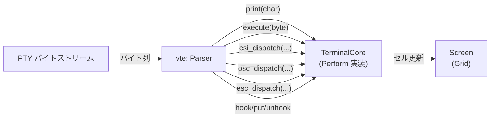
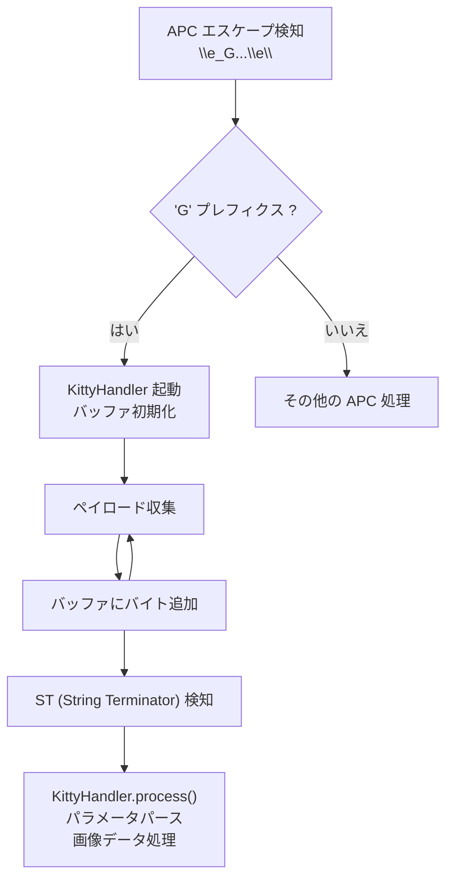

# VTE パーサー仕様

## 概要

kuro は [vte crate](https://crates.io/crates/vte) v0.15.0 の `Perform` トレイトを実装し、PTY からのバイトストリームを ANSI/VT エスケープシーケンスとしてパースする。vte crate は状態遷移ベースのパーサーであり、入力バイト列を1バイトずつ消費して適切なコールバックメソッドを呼び出す。



## パーサー駆動ループ

```rust
use vte::{Parser, Perform};

let mut parser = Parser::new();
let mut terminal = TerminalCore::new(24, 80);

// PTY からのバイト列を一括処理
fn process_bytes(parser: &mut Parser, terminal: &mut TerminalCore, bytes: &[u8]) {
    parser.advance(terminal, bytes);
}
```

`Parser::advance()` はバイトスライス (`&[u8]`) を受け取り、VT状態機械を遷移させながら、完全なシーケンスを認識した時点で対応する `Perform` メソッドを呼び出す。

## Perform トレイト実装

### `print(c: char)`

印刷可能文字の出力。カーソル位置にセルを書き込み、カーソルを右に移動する。

```rust
impl vte::Perform for TerminalCore {
    fn print(&mut self, c: char) {
        // カーソル位置に文字を書き込み
        let cell = Cell {
            c,
            fg: self.current_attr.fg,
            bg: self.current_attr.bg,
            bold: self.current_attr.bold,
            italic: self.current_attr.italic,
            underline: self.current_attr.underline,
            strikethrough: self.current_attr.strikethrough,
            image_id: None,
        };
        self.screen.update_cell(self.screen.cursor.x, self.screen.cursor.y, cell);

        // カーソルを右に移動（行末での折り返し処理を含む）
        self.screen.cursor.x += 1;
        if self.screen.cursor.x >= self.screen.cols {
            self.screen.cursor.x = 0;
            self.move_cursor_down_with_scroll(1);
        }
    }
}
```

| 引数 | 型 | 説明 |
|---|---|---|
| `c` | `char` | 印刷可能な Unicode 文字。 |

**動作詳細:**
- 現在の文字属性（`current_attr`）を適用した Cell を生成する。
- CJK 幅広文字（`unicode_width::UnicodeWidthChar` でセル幅2と判定される文字）の場合、次のセルにプレースホルダー（幅ゼロ）を配置する。
- 行末到達時は自動折り返し（auto-wrap）する。DECAWM モード（`?7h` / `?7l`）により制御される。

### `execute(byte: u8)`

C0 制御文字（`0x00..=0x1F`）の処理。

```rust
fn execute(&mut self, byte: u8) {
    match byte {
        0x0A => {                    // LF (Line Feed)
            self.move_cursor_down_with_scroll(1);
        }
        0x0D => {                    // CR (Carriage Return)
            self.screen.cursor.x = 0;
        }
        0x08 => {                    // BS (Backspace)
            if self.screen.cursor.x > 0 {
                self.screen.cursor.x -= 1;
            }
        }
        0x07 => {                    // BEL (Bell)
            self.bell_pending = true;
        }
        0x09 => {                    // HT (Horizontal Tab)
            let next_tab = (self.screen.cursor.x / 8 + 1) * 8;
            self.screen.cursor.x = next_tab.min(self.screen.cols - 1);
        }
        _ => {}
    }
}
```

| バイト値 | 名称 | 動作 |
|---|---|---|
| `0x07` | BEL | ベル通知フラグを立てる。Emacs 側で `ding` を呼び出す。 |
| `0x08` | BS | カーソルを1つ左に移動。列0では無視。 |
| `0x09` | HT | 次のタブストップ（8の倍数位置）へカーソルを移動。 |
| `0x0A` | LF | カーソルを1行下に移動。最下行ではスクロールアップ。 |
| `0x0D` | CR | カーソルを行頭（列0）に移動。 |

### `csi_dispatch(params, intermediates, ignore, action)`

CSI（Control Sequence Introducer, `ESC [` で開始）シーケンスの処理。ターミナル制御の主要部分を担う。

```rust
fn csi_dispatch(
    &mut self,
    params: &vte::Params,
    intermediates: &[u8],
    ignore: bool,
    action: char,
) {
    if ignore {
        return;
    }

    match action {
        'm' => self.handle_sgr(params),
        'H' | 'f' => self.handle_cup(params),
        'A' => self.handle_cursor_up(params),
        'B' => self.handle_cursor_down(params),
        'C' => self.handle_cursor_forward(params),
        'D' => self.handle_cursor_backward(params),
        'J' => self.handle_erase_display(params),
        'K' => self.handle_erase_line(params),
        'L' => self.handle_insert_lines(params),
        'M' => self.handle_delete_lines(params),
        'r' => self.handle_set_scroll_region(params),
        'h' => self.handle_set_mode(params, intermediates, true),
        'l' => self.handle_set_mode(params, intermediates, false),
        'd' => self.handle_line_position_absolute(params),
        'G' => self.handle_cursor_character_absolute(params),
        'P' => self.handle_delete_chars(params),
        '@' => self.handle_insert_chars(params),
        'X' => self.handle_erase_chars(params),
        'S' => self.handle_scroll_up(params),
        'T' => self.handle_scroll_down(params),
        _ => {}
    }
}
```

| 引数 | 型 | 説明 |
|---|---|---|
| `params` | `&vte::Params` | セミコロン区切りの数値パラメータ列。イテレータとしてアクセスする。 |
| `intermediates` | `&[u8]` | 中間バイト。`?`（DEC private モード）、`>`、`!` 等。 |
| `ignore` | `bool` | パーサーが不正なシーケンスと判断した場合 `true`。 |
| `action` | `char` | シーケンスの終端文字。 |

#### CSI シーケンス一覧

| アクション文字 | シーケンス名 | 形式 | 説明 |
|---|---|---|---|
| `m` | SGR | `CSI Pm m` | 文字属性（色・スタイル）の設定。後述の SGR パラメータ表を参照。 |
| `H` / `f` | CUP | `CSI Py;Px H` | カーソル位置設定。パラメータは1始まり。 |
| `A` | CUU | `CSI Pn A` | カーソルを n 行上に移動。 |
| `B` | CUD | `CSI Pn B` | カーソルを n 行下に移動。 |
| `C` | CUF | `CSI Pn C` | カーソルを n 列右に移動。 |
| `D` | CUB | `CSI Pn D` | カーソルを n 列左に移動。 |
| `J` | ED | `CSI Ps J` | 画面消去。`Ps=0`: カーソル以降、`Ps=1`: カーソル以前、`Ps=2`: 全画面。 |
| `K` | EL | `CSI Ps K` | 行消去。`Ps=0`: カーソル以降、`Ps=1`: カーソル以前、`Ps=2`: 全行。 |
| `L` | IL | `CSI Pn L` | カーソル行の位置に n 行の空行を挿入。下方の行は押し下げられる。 |
| `M` | DL | `CSI Pn M` | カーソル行から n 行を削除。下方の行が繰り上がる。 |
| `r` | DECSTBM | `CSI Pt;Pb r` | スクロール領域設定。`Pt`: 上端行、`Pb`: 下端行（1始まり）。 |
| `h` | SM/DECSET | `CSI ? Pm h` | モード有効化。 |
| `l` | RM/DECRST | `CSI ? Pm l` | モード無効化。 |
| `d` | VPA | `CSI Pn d` | カーソルを指定行に移動（列は変更しない）。 |
| `G` | CHA | `CSI Pn G` | カーソルを指定列に移動（行は変更しない）。 |
| `P` | DCH | `CSI Pn P` | カーソル位置から n 文字を削除。 |
| `@` | ICH | `CSI Pn @` | カーソル位置に n 個の空白を挿入。 |
| `X` | ECH | `CSI Pn X` | カーソル位置から n 文字を消去（スペースで埋める）。 |
| `S` | SU | `CSI Pn S` | 画面を n 行上スクロール。 |
| `T` | SD | `CSI Pn T` | 画面を n 行下スクロール。 |

#### DEC Private モード

`intermediates` に `?` が含まれる場合、DEC private モードとして処理する。

| パラメータ | モード名 | 説明 |
|---|---|---|
| `1` | DECCKM | カーソルキーモード。Application / Normal 切替。 |
| `7` | DECAWM | 自動折り返しモード。 |
| `25` | DECTCEM | カーソル表示/非表示。 |
| `1049` | — | Alternate Screen Buffer の切替（smcup/rmcup）。 |
| `2004` | — | Bracketed Paste Mode。 |

## SGR (Select Graphic Rendition) パラメータ表

`CSI Pm m` で指定する文字属性パラメータ。複数パラメータをセミコロンで連結可能（例: `CSI 1;31m`）。

| パラメータ | 効果 | 対応フィールド |
|---|---|---|
| `0` | 全属性リセット | 全フィールドを Default/false に |
| `1` | ボールド | `bold = true` |
| `2` | 暗い (Dim) | `dim = true` |
| `3` | イタリック | `italic = true` |
| `4` | アンダーライン | `underline = true` |
| `7` | 反転表示 | fg と bg を入れ替え |
| `9` | 取り消し線 | `strikethrough = true` |
| `22` | ボールド/Dim 解除 | `bold = false`, `dim = false` |
| `23` | イタリック解除 | `italic = false` |
| `24` | アンダーライン解除 | `underline = false` |
| `27` | 反転解除 | fg と bg を元に戻す |
| `29` | 取り消し線解除 | `strikethrough = false` |
| `30`-`37` | 前景色（ANSI 標準） | `fg = Color::Named(...)` |
| `38;5;n` | 前景色（256色） | `fg = Color::Indexed(n)` |
| `38;2;r;g;b` | 前景色（TrueColor） | `fg = Color::Rgb(r, g, b)` |
| `39` | 前景色デフォルト | `fg = Color::Default` |
| `40`-`47` | 背景色（ANSI 標準） | `bg = Color::Named(...)` |
| `48;5;n` | 背景色（256色） | `bg = Color::Indexed(n)` |
| `48;2;r;g;b` | 背景色（TrueColor） | `bg = Color::Rgb(r, g, b)` |
| `49` | 背景色デフォルト | `bg = Color::Default` |
| `90`-`97` | 前景色（ANSI Bright） | `fg = Color::Named(Bright...)` |
| `100`-`107` | 背景色（ANSI Bright） | `bg = Color::Named(Bright...)` |

### SGR パース実装

```rust
fn handle_sgr(&mut self, params: &vte::Params) {
    let mut iter = params.iter();

    while let Some(param) = iter.next() {
        match param[0] {
            0 => self.current_attr = CellAttr::default(),
            1 => self.current_attr.bold = true,
            2 => self.current_attr.dim = true,
            3 => self.current_attr.italic = true,
            4 => self.current_attr.underline = true,
            9 => self.current_attr.strikethrough = true,
            22 => {
                self.current_attr.bold = false;
                self.current_attr.dim = false;
            }
            23 => self.current_attr.italic = false,
            24 => self.current_attr.underline = false,
            29 => self.current_attr.strikethrough = false,
            30..=37 => {
                self.current_attr.fg = Color::Named(
                    NamedColor::from_ansi(param[0] - 30)
                );
            }
            38 => {
                if let Some(color) = self.parse_extended_color(&mut iter) {
                    self.current_attr.fg = color;
                }
            }
            39 => self.current_attr.fg = Color::Default,
            40..=47 => {
                self.current_attr.bg = Color::Named(
                    NamedColor::from_ansi(param[0] - 40)
                );
            }
            48 => {
                if let Some(color) = self.parse_extended_color(&mut iter) {
                    self.current_attr.bg = color;
                }
            }
            49 => self.current_attr.bg = Color::Default,
            90..=97 => {
                self.current_attr.fg = Color::Named(
                    NamedColor::from_ansi_bright(param[0] - 90)
                );
            }
            100..=107 => {
                self.current_attr.bg = Color::Named(
                    NamedColor::from_ansi_bright(param[0] - 100)
                );
            }
            _ => {}
        }
    }
}
```

### 拡張色パース

```rust
fn parse_extended_color(
    &self,
    iter: &mut impl Iterator<Item = &[u16]>,
) -> Option<Color> {
    match iter.next()?.first()? {
        5 => {
            // 256色: 38;5;n / 48;5;n
            let index = *iter.next()?.first()? as u8;
            Some(Color::Indexed(index))
        }
        2 => {
            // TrueColor: 38;2;r;g;b / 48;2;r;g;b
            let r = *iter.next()?.first()? as u8;
            let g = *iter.next()?.first()? as u8;
            let b = *iter.next()?.first()? as u8;
            Some(Color::Rgb(r, g, b))
        }
        _ => None,
    }
}
```

## OSC シーケンス

```rust
fn osc_dispatch(&mut self, params: &[&[u8]], bell_terminated: bool) {
    if params.is_empty() {
        return;
    }

    match params[0] {
        b"0" | b"2" => {
            // ウィンドウタイトル設定
            if let Some(title) = params.get(1) {
                self.title = String::from_utf8_lossy(title).into_owned();
            }
        }
        b"8" => {
            // ハイパーリンク: OSC 8 ; params ; uri ST
            // 省略
        }
        _ => {}
    }
}
```

| パラメータ | シーケンス | 説明 |
|---|---|---|
| `0` | `OSC 0 ; text ST` | アイコン名とウィンドウタイトルを設定。 |
| `2` | `OSC 2 ; text ST` | ウィンドウタイトルを設定。 |
| `8` | `OSC 8 ; params ; uri ST` | ハイパーリンクの設定/解除。 |

## ESC シーケンス

```rust
fn esc_dispatch(&mut self, intermediates: &[u8], ignore: bool, byte: u8) {
    if ignore {
        return;
    }

    match byte {
        b'7' => {
            // DECSC: カーソル位置保存
            self.saved_cursor = Some(self.screen.cursor.clone());
        }
        b'8' => {
            if intermediates == [b'#'] {
                // DECALN: 画面をEで埋める（アライメントテスト）
                self.fill_screen_with_e();
            } else {
                // DECRC: カーソル位置復元
                if let Some(cursor) = self.saved_cursor.take() {
                    self.screen.cursor = cursor;
                }
            }
        }
        b'D' => {
            // IND: カーソルを1行下に移動（スクロールあり）
            self.move_cursor_down_with_scroll(1);
        }
        b'M' => {
            // RI: カーソルを1行上に移動（逆スクロールあり）
            self.move_cursor_up_with_scroll(1);
        }
        b'c' => {
            // RIS: 端末リセット
            self.reset();
        }
        _ => {}
    }
}
```

| バイト | 中間バイト | シーケンス名 | 説明 |
|---|---|---|---|
| `7` | — | DECSC | カーソル位置と属性を保存。 |
| `8` | — | DECRC | 保存したカーソル位置と属性を復元。 |
| `8` | `#` | DECALN | 画面全体を文字 `E` で埋める（表示アライメントテスト用）。 |
| `D` | — | IND | カーソルを1行下へ移動。最下行ではスクロールアップ。 |
| `M` | — | RI | カーソルを1行上へ移動。最上行では逆スクロール。 |
| `c` | — | RIS | 端末を初期状態にリセット。 |

## APC シーケンスと Kitty Graphics への委譲

Kitty Graphics Protocol は APC（Application Program Command, `ESC _`）シーケンスを使用する（DCS ではない）。標準の vte v0.15.0 では `hook` / `put` / `unhook` コールバックは DCS（Device Control String, `ESC P`）用であり、APC シーケンスの処理方式は異なる。

kuro では APC シーケンスを正しく処理するため、以下のいずれかのアプローチを採用する:

1. **vte のフォーク/拡張版を使用**: APC シーケンスを `hook`/`put`/`unhook` と同様のコールバックで処理できるよう拡張された vte クレート（例: vte-graphics）を使用する。
2. **カスタム APC ハンドラ**: vte のバイトストリーム処理前段で `ESC _` を検知し、独自のバッファリングとパース処理を行う。



以下は vte の拡張版（APC 対応）を使用した場合の実装例:

```rust
fn apc_start(&mut self, payload: &[u8]) {
    if payload.starts_with(b"G") {
        // Kitty Graphics シーケンス開始
        self.kitty_handler = Some(KittyHandler::new_from_apc(payload));
    }
}

fn apc_put(&mut self, byte: u8) {
    if let Some(ref mut handler) = self.kitty_handler {
        handler.push_byte(byte);
    }
}

fn apc_end(&mut self) {
    if let Some(handler) = self.kitty_handler.take() {
        handler.process(&mut self.screen, &mut self.graphics_store);
    }
}
```

> **注意**: 標準 vte v0.15.0 の `hook`/`put`/`unhook` は DCS 専用であり、APC (`ESC _`) には対応していない。Kitty Graphics の処理には vte の APC 対応フォーク（例: vte-graphics）の使用、または独自の前処理パーサーが必要となる。

Kitty Graphics の詳細な処理仕様については [Kitty Graphics Protocol 処理仕様](./kitty-graphics.md) を参照。
