# Kuro 開発フェーズ

## プロジェクト概要

**Kuro** は、Rust + Elisp のハイブリッドアーキテクチャで構築された Emacs 用高性能ターミナルエミュレータです：

- **Rust Core**: PTY 管理、VTE パース、グリッド状態管理
- **Elisp UI**: レンダリング、Face 適用、ユーザーインタラクション
- **FFI Bridge**: Emacs Dynamic Modules による高性能通信

### アーキテクチャ

```
+------------------+     FFI Bridge      +------------------+
|   Emacs Lisp     |<------------------->|    Rust Core     |
|  (Display/UI)    |    ~100ns calls     | (Logic/State)    |
+------------------+                     +------------------+
        |                                        |
        v                                        v
   Emacs Buffer                              PTY/Shell
   (Rendered)                              (Process I/O)
```

## フェーズ一覧（全22週間）

| フェーズ | 名称 | 期間 | ステータス | 説明 |
|----------|------|------|------------|------|
| [01](./01-shell-prompt.md) | シェルプロンプト表示 | Week 1 | 未着手 | 基本PTYセットアップとシェルプロンプト描画 |
| [02](./02-text-output.md) | 基本テキスト出力 | Week 2 | 未着手 | echo, cat, C0制御文字, 自動折り返し |
| [03](./03-command-line-editing.md) | コマンドライン編集 | Week 3 | 未着手 | カーソル移動, ED/ELシーケンス, キーボード入力 |
| [04](./04-basic-colors.md) | 基本色（16色） | Week 4 | 未着手 | SGRシーケンス, ANSI 16色, テキストスタイル |
| [05](./05-extended-colors.md) | 拡張色 | Week 5 | 未着手 | 256色, TrueColor対応 |
| [06](./06-vim-basic.md) | vim基本表示 | Week 6-7 | 未着手 | 代替バッファ, DECモード, vim起動 |
| [07](./07-vim-full.md) | vim完全編集 | Week 8-9 | 未着手 | 挿入/削除, スクロール領域, vim完全対応 |
| [08](./08-less-navigation.md) | lessナビゲーション | Week 10 | 未着手 | ページ移動, less内検索 |
| [09](./09-top-display.md) | top/htop表示 | Week 11 | 未着手 | リアルタイム更新, パフォーマンス最適化 |
| [10](./10-tmux-support.md) | tmuxサポート | Week 12-13 | 未着手 | ペイン分割, OSCシーケンス, ブラケットペースト |
| [11](./11-unicode-cjk.md) | Unicode & CJK | Week 14 | 未着手 | 全角文字, 絵文字, 結合文字 |
| [12](./12-scrollback.md) | スクロールバック管理 | Week 15-16 | 未着手 | 履歴バッファ, ナビゲーション |
| [13](./13-keyboard-input.md) | キーボード入力完全版 | Week 17 | 未着手 | 全キー組み合わせ, ファンクションキー, 修飾キー |
| [14](./14-configuration.md) | 設定システム | Week 18 | 未着手 | defcustom, ユーザー設定, 実行時設定 |
| [15](./15-kitty-graphics.md) | Kitty Graphics Protocol | Week 19-20 | 未着手 | 画像表示, APCシーケンス |
| [16](./16-testing-release.md) | テスト & リリース | Week 21-22 | 未着手 | vttest 80%+, セキュリティ監査, v1.0.0リリース |

## 進捗管理

### 全体進捗

```
完了フェーズ: [ ] 0% (0/16 フェーズ完了)
総期間: 22週間
```

### フェーズグループ

| グループ | フェーズ | 週 | ステータス |
|----------|----------|-----|------------|
| 基盤構築 | 01-04 | 1-4 | 未着手 |
| VTEコア | 05-09 | 5-11 | 未着手 |
| 高度な機能 | 10-12 | 12-16 | 未着手 |
| 仕上げ & リリース | 13-16 | 17-22 | 未着手 |

## クイックリンク

### フェーズドキュメント
- [Phase 01: シェルプロンプト表示](./01-shell-prompt.md)
- [Phase 02: 基本テキスト出力](./02-text-output.md)
- [Phase 03: コマンドライン編集](./03-command-line-editing.md)
- [Phase 04: 基本色（16色）](./04-basic-colors.md)
- [Phase 05: 拡張色](./05-extended-colors.md)
- [Phase 06: vim基本表示](./06-vim-basic.md)
- [Phase 07: vim完全編集](./07-vim-full.md)
- [Phase 08: lessナビゲーション](./08-less-navigation.md)
- [Phase 09: top/htop表示](./09-top-display.md)
- [Phase 10: tmuxサポート](./10-tmux-support.md)
- [Phase 11: Unicode & CJK](./11-unicode-cjk.md)
- [Phase 12: スクロールバック管理](./12-scrollback.md)
- [Phase 13: キーボード入力完全版](./13-keyboard-input.md)
- [Phase 14: 設定システム](./14-configuration.md)
- [Phase 15: Kitty Graphics Protocol](./15-kitty-graphics.md)
- [Phase 16: テスト & リリース](./16-testing-release.md)

### リファレンスドキュメント
- [Grid仕様](../docs/reference/rust-core/grid.md)
- [FFIインターフェース](../docs/reference/rust-core/ffi-interface.md)
- [VTEパーサー](../docs/reference/rust-core/parser.md)
- [Kitty Graphics](../docs/reference/rust-core/kitty-graphics.md)
- [データフロー](../docs/reference/data-flow.md)
- [Elispレンダラー](../docs/reference/elisp/renderer.md)
- [モジュールブリッジ](../docs/reference/elisp/module-bridge.md)

### 開発ガイド
- [Getting Started](../docs/tutorials/getting-started.md)
- [セットアップガイド](../docs/development/setup.md)
- [コントリビュート](../CONTRIBUTING.md)

## フェーズ依存関係

```mermaid
graph LR
    P01[Phase 01<br/>シェルプロンプト] --> P02[Phase 02<br/>テキスト出力]
    P02 --> P03[Phase 03<br/>コマンドライン]
    P03 --> P04[Phase 04<br/>基本色]
    P04 --> P05[Phase 05<br/>拡張色]
    P05 --> P06[Phase 06<br/>vim基本]
    P06 --> P07[Phase 07<br/>vim完全]
    P07 --> P08[Phase 08<br/>less]
    P08 --> P09[Phase 09<br/>top]
    P09 --> P10[Phase 10<br/>tmux]
    P10 --> P11[Phase 11<br/>Unicode]
    P11 --> P12[Phase 12<br/>スクロールバック]
    P12 --> P13[Phase 13<br/>キーボード]
    P13 --> P14[Phase 14<br/>設定]
    P14 --> P15[Phase 15<br/>グラフィックス]
    P15 --> P16[Phase 16<br/>リリース]
```



各フェーズは前のフェーズを基に構築されます。すべてのフェーズを順番に完了する必要があります。

## テスト戦略

各フェーズには手動テスト手順が含まれており、以下を検証します：

1. **機能性**: コア機能が期待通りに動作する
2. **統合**: Rust-Elisp間の通信が正しく動作する
3. **ユーザー体験**: ターミナルが標準的なターミナルとして動作する

具体的なテスト手順は各フェーズのドキュメントを参照してください。

## 主要マイルストーン

| マイルストーン | フェーズ | 成果物 |
|----------------|----------|--------|
| 基本シェル | Phase 02 | シェルプロンプトとechoが動作 |
| 色対応 | Phase 05 | フルカラー対応（256色 + TrueColor） |
| vim互換 | Phase 07 | vimで完全な編集が可能 |
| TUIアプリ | Phase 09 | top, htopが正しく動作 |
| 本番対応 | Phase 16 | vttest 80%+, v1.0.0リリース |

## 次のステップ

1. [Phase 01: シェルプロンプト表示](./01-shell-prompt.md)から開始
2. 各フェーズのタスクチェックリストに従う
3. 次のフェーズに進む前に手動テスト手順を完了
4. 進捗に合わせてステータス追跡を更新
